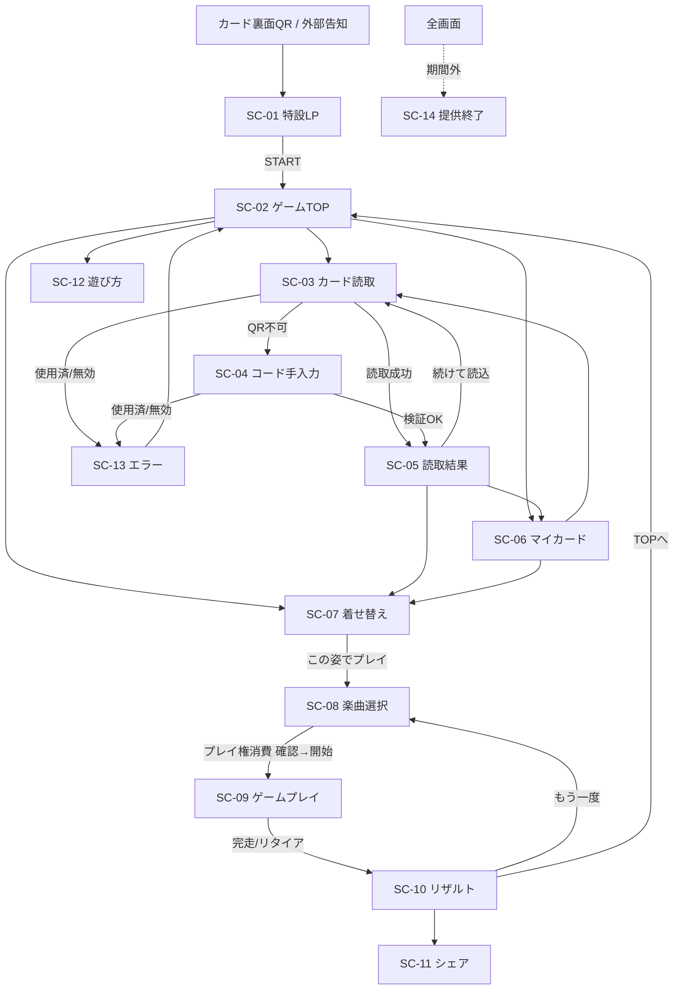
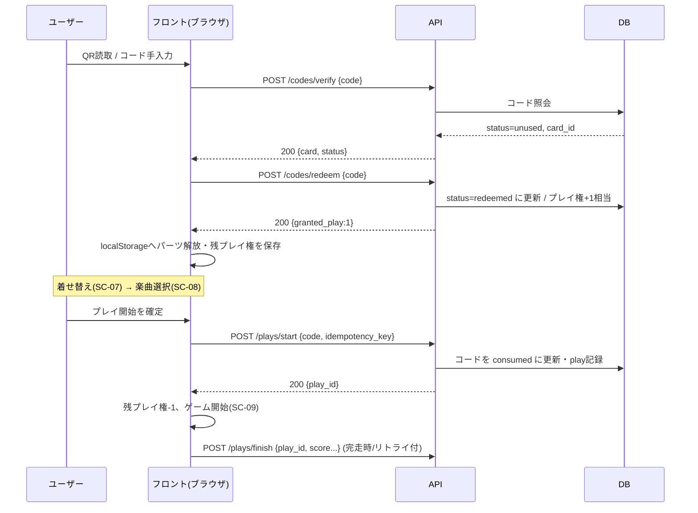
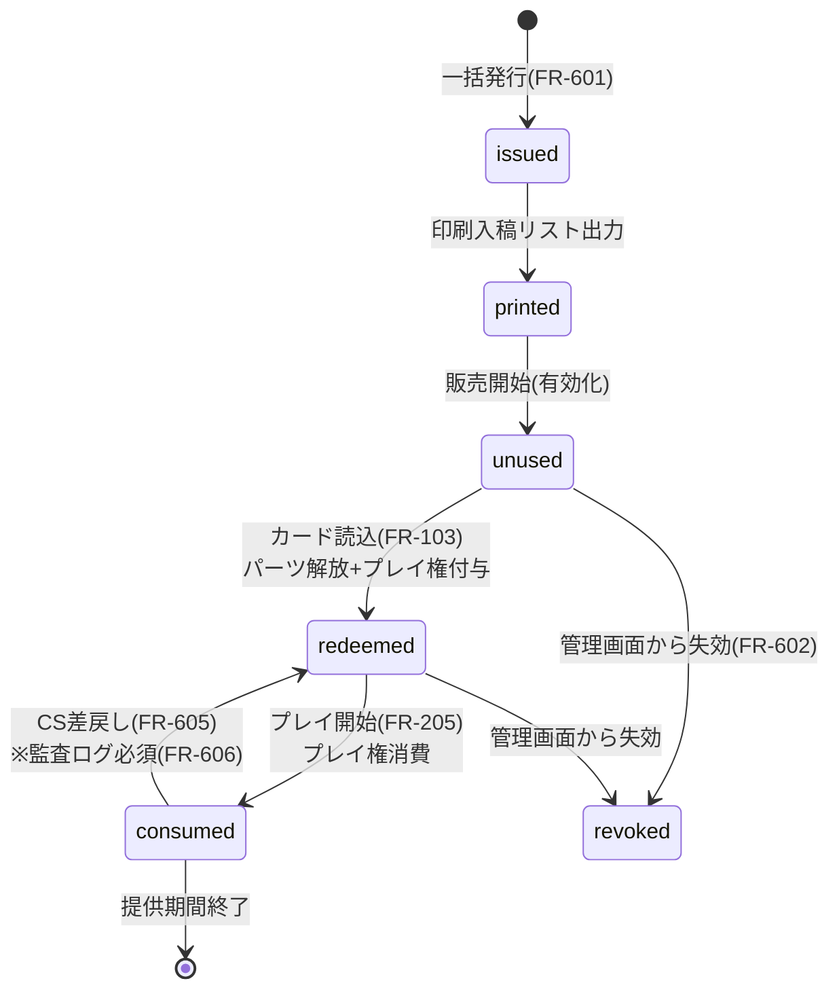

# ちゃんみな × ラブandベリー コラボWEBミニゲーム　要件定義書

**Ver.0.3（ドラフト）** ｜ 更新日 2026年8月13日 ｜ 出典：GEKI企画書 2026_08_12 ＋ GEKI_WBS_PMSheet貼付用

## 0. 変更履歴

| Ver | 日付 | 変更内容 |
|---|---|---|
| 0.1 | 2026-08-12 | 初版。企画書からの要件抽出 |
| 0.2 | 2026-08-13 | 基本方針5件の決定を反映（1B／2A／3A／4A／歌詞演出あり）。FR 42件・SC 15・NFR 16・CQ 17に整理 |
| 0.3 | 2026-08-13 | 詳細設計フェーズへの橋渡しとして大幅拡充：画面遷移図／コードライフサイクル／API設計案／データモデル案／エラーコード体系／計測設計／テスト観点／リスク一覧／FAQドラフト／用語集を追加。FR 6件追加（FR-107, FR-207, FR-306改, FR-409, FR-410, FR-506, FR-606）。プロトタイプ v0.2 対応 |
| 0.3.1 | 2026-08-13 | キャラクターダンス演出（FR-411）を追加。3Dモデル制作をスコープOUTに明記し、2.5D表現（レイヤーアニメ）を推奨方式として定義。プロトタイプ v0.2.1 で実演 |

## 1. 概要

### 1-1. プロダクト定義

- **プロダクト名**：ちゃんみな × ラブandベリー コラボWEBミニゲーム（仮）（正式名称は別途決定）
- **形態**：スマートフォンブラウザ向けWEBコンテンツ（ネイティブアプリではない）
- **コンセプト**：「Collect Your Bible.」ちゃんみな10周年を記念し、ファッションを切り口に軌跡と言葉をカードとして集める体験（企画書 p.2）
- **世界観設定**：ラブベリの復刻ではなく「ラブとベリーがちゃんみなの空間に遊びに来た」設定の新規開発（企画書 p.5）
- **コア体験**：フィジカルカードのQR読取 → パーツを集めて着せ替え → その姿を背景にリズムゲーム → SNSシェア
- **ローンチ**：2027年3月15日（WBS G-10）
- **提供期間**：ローンチから3ヶ月間の期間限定（〜2027年6月中旬想定）（正式な開始／終了日は要確定（CQ-12））

### 1-2. 確定済みの基本方針

- **着せ替え方式**：【パーツ組合せ型】4枚（ヘア／服／靴／小道具）を読み込んで1コーデを構成する（決定：論点1-B）
- **プレイ制限方式**：【1コード1プレイ】カード1枚＝1コード。読込でパーツを解放しプレイ権を1回付与、プレイ開始時にコードを消費する（決定：論点2-A／企画書 p.10 の推奨方式）
- **販売形態**：1パック 2,500円 × 4パック（決定：論点3-A／企画書 p.7）
- **素体モデル**：ちゃんみな 1体のみ（ラブ／ベリーの素体は制作しない）（決定：論点4-A／工数抑制のため）
- **歌詞の扱い**：ゲーム内に歌詞を表示する（歌詞演出あり）（決定：論点5／出版権クリアが前提条件（CQ-06））

### 1-3. この方針から派生する重要論点

- **プレイ可能回数**：プレイ可能回数＝購入したカード枚数。1パック4枚＝4プレイ、全17枚購入で17プレイとなる（1コード1プレイの直接的な帰結）
- **システムの簡素化**：コードは使い切りのため、端末紐付け・他端末制御・紐付け解除フローが不要となる（2B案と比較した最大のメリット）
- **パーツ解放とプレイ権の分離**：読込時にパーツ解放とプレイ権付与が同時に発生する。プレイ権はプレイ開始時に消費されるが、解放済みパーツは提供期間中そのまま使える（★要確定：CQ-04）
- **転売対策の効き方**：使用済みコードは無価値となるため転売が成立しない。ただし未使用カードの転売は防げない（企画書 p.10 の懸念点と同じ）
- **状態消失時の非対称性**：ブラウザデータ消失時、未使用カードは再読込で復元できるが、使用済みカードのパーツ解放状態は復元できない（利用規約とFAQへの明記が必要（NFR-011／FAQ草案 §13））

### 1-4. 本書の使い方

- **位置づけ**：GEKI企画書の内容を実装可能な粒度に分解したもの。クライアント承認前のドラフト（WBS C-01「ゲーム仕様書 作成」の前段資料）
- **v0.3の拡充方針**：C-01（ゲーム仕様書）・C-05（画面遷移設計）・E系（サーバー設計）へそのまま展開できるよう、API・データモデル・エラー体系・計測を「設計案」として先行記述した。これらは**技術チーム（永沼様）レビュー前の提案**であり、確定仕様ではない
- **未確定箇所**：「確認事項」（§14）に集約。★印は他タスクをブロックする最優先項目
- **次アクション**：確認事項★を潰したうえで、ゲーム仕様書（C-01）および画面遷移設計（C-05）へ展開

### 1-5. サマリ（v0.3.1時点）

- 機能要件 49件（Must 38／Should 11）・画面 15・非機能要件 18・確認事項 17件（うち★6件）
- 新規：API 7本（案）・テーブル 5（案）・エラーコード 10・計測イベント 14・テスト観点 24・リスク 8・FAQ 10

## 2. スコープ

| 区分 | 領域 | 内容 | 備考 |
|---|---|---|---|
| IN | フロントエンド | 特設LP／ゲームTOP／QR読取／カード登録／着せ替えUI／リズムゲーム／リザルト／シェア |  |
| IN | フロントエンド | 読込済カード一覧と残プレイ権数の表示 | 1B決定により発生 |
| IN | サーバーサイド | コード発行・認証API／コード使用状態の管理／プレイデータ記録／管理画面 |  |
| IN | アセット | 2D素体1体（ちゃんみな）、着せ替えパーツ3曲分、背景・演出素材、ゲームUI | 素体はちゃんみなのみ（4A決定） |
| IN | アセット | カードデザイン 通常12種＋シークレット5種、説明書・パッケージデザイン | 計17種 |
| IN | 音楽 | 楽曲3曲＋シークレット1の譜面制作・演出調整、歌詞演出 | 歌詞表示あり（決定） |
| IN | 運用 | 提供期間終了フロー、CS／FAQ、告知素材、初週監視 | WBS G-06〜G-12 |
| OUT | アプリ | iOS／Androidネイティブアプリの開発 | WEBのみ |
| OUT | ゲーム | ラブandベリー原作ゲームの復刻・移植・エミュレーション | 企画書 p.5 に明記 |
| OUT | 映像 | MV映像素材のゲーム内使用 | 企画書 p.9「MVが使用できない中でも」 |
| OUT | アセット | ラブ／ベリーの2D素体モデル制作 | 4A決定。UI・フレーム内での登場に留める（CQ-05） |
| OUT | アセット | 3Dキャラクターモデルの制作・リギング | 企画書 p.9「映像は2Dビューでの制作」に準拠。ダンス演出は2Dパーツの2.5D表現で実現（FR-411） |
| OUT | 販売 | カードのEC構築・決済・在庫・物流 | MDチーム側の想定。要確認 |
| OUT | 会員 | 会員登録・ID/PW認証・メール配信基盤 | 2A決定によりログインは実装しない |
| OUT | システム | 端末紐付け管理・他端末制御・紐付け解除フロー | 2A決定により不要。設計を大幅に簡素化できる |
| OUT | 運用 | 提供期間（3ヶ月）を超える恒久運用・サーバー継続稼働 | 終了後1ヶ月の保守のみ |
| OUT | 多言語 | 日本語以外の言語対応 | 要確認：海外ファン向け需要 |
| 保留 | 販促 | リアルイベント連動・店頭施策との接続 | 実施有無が未定 |
| 保留 | 機能 | 全カードコンプリート時の特典・限定演出 | 施策として検討余地あり（CQ-11と連動／FR-506をShouldで仮置き） |

## 3. 機能要件一覧

優先度：Must＝ローンチ必須／Should＝可能な限り実装／Could＝余力があれば
（v0.3追加分は備考に【v0.3新規】と表記）

| ID | グループ | 機能名 | 要件内容 | 優先度 | 関連画面 | 備考 |
|---|---|---|---|---|---|---|
| FR-001 | 共通・基盤 | 特設LPからのゲーム起動 | カード裏面QRから特設LPに遷移し、STARTタップでゲームTOPへ進む | Must | SC-01,SC-02 | 企画書 p.6 フロー①〜④ |
| FR-002 | 共通・基盤 | ローカル状態の保持 | 解放済みパーツと残プレイ権をブラウザのlocalStorageに保持する。サーバー側で端末を識別・紐付けすることはしない | Must | 全画面 | 個人情報は取得しない。保持項目は §8-2 参照 |
| FR-003 | 共通・基盤 | 提供期間の制御 | 提供期間外のアクセスは終了画面に誘導する。開始前・終了後で文言を出し分ける | Must | SC-14 | WBS G-08／APIは E-003 を返す |
| FR-004 | 共通・基盤 | 対応外環境の案内 | 非対応ブラウザ・PC・横持ち時に案内を表示する | Must | SC-13 |  |
| FR-005 | 共通・基盤 | 遊び方の説明 | 初回起動時のチュートリアル、および常時参照できる遊び方ページを提供する | Must | SC-12 | パーツ組合せ型のため説明必須 |
| FR-101 | カード読取 | QRコード読取 | ブラウザのカメラでカード表面のQRを読み取る。読取ガイドと失敗時の再試行導線を持つ | Must | SC-03 | 企画書 p.6 フロー⑤ |
| FR-102 | カード読取 | コード検証 | 読み取ったコードをサーバーで照合し「未使用／使用済／無効」を判定する | Must | SC-03,SC-05 | API-01 |
| FR-103 | カード読取 | パーツ解放とプレイ権付与 | 有効なコードの読取により、対応するパーツを解放し、プレイ権を1回分付与する | Must | SC-05 | 1コード1プレイの中核。API-02 |
| FR-104 | カード読取 | 使用済みコードの制御 | 既に使用済みのコードはプレイ権を付与せず、理由と問い合わせ導線を案内する | Must | SC-13 | 転売対策の実体。誤消費時の救済は CQ-03 |
| FR-105 | カード読取 | コード手入力 | QR読取ができない場合にカード印字コードを手入力できる代替手段を提供する | Should | SC-04 | CSコスト削減に寄与 |
| FR-106 | カード読取 | 読取結果の表示 | 読み取ったカードの絵柄・パーツ種別・対応楽曲・ラッキーカラーを表示する | Must | SC-05 | 企画書 p.6 フロー⑥ |
| FR-107 | カード読取 | 読取試行の制限 | 短時間の連続失敗（無効コード連投）に対しレート制限を適用し、一定回数超過で一時的に入力を受け付けない | Must | SC-03,SC-04 | 【v0.3新規】NFR-008の画面側実装。総当たり対策 |
| FR-201 | カード管理 | 読込済カード一覧 | 読み込んだカードを楽曲別・パーツ別に一覧表示し、残プレイ権数を常時明示する | Must | SC-06 | 1B決定により発生 |
| FR-202 | カード管理 | 収集進捗の可視化 | 全17種のうち何種を所持しているか、コーデが何セット完成しているかを表示する | Should | SC-06 | 収集動機の中核 |
| FR-203 | カード管理 | 状態消失時の再読込 | ブラウザデータ消失時、未使用カードは再読込で復元できる。使用済みカードのパーツ解放状態は復元されない | Must | SC-03,SC-06 | 規約とFAQへの明記が必要（CQ-04／FAQ Q7） |
| FR-204 | カード管理 | 重複読込の扱い | 同一カードを再読込した場合は「使用済み」として扱い、プレイ権を重複付与しない | Must | SC-05 |  |
| FR-205 | カード管理 | プレイ権の消費 | プレイ開始時にプレイ権を1回分消費し、サーバー上で該当コードを使用済みに更新する | Must | SC-08,SC-09 | 消費タイミングは開始時／完走時で要決定（CQ-03）。API-03 |
| FR-206 | カード管理 | 残プレイ権ゼロ時の案内 | プレイ権が残っていない場合、追加カードの購入・読込を促す画面を表示する | Must | SC-06,SC-08 |  |
| FR-207 | カード管理 | プレイ権消費の冪等性 | プレイ開始リクエストの二重送信・リトライで同一コードが二重消費されないよう、リクエストに冪等キーを付与する | Must | SC-08 | 【v0.3新規】通信リトライ（NFR-016）と組で必須 |
| FR-301 | 着せ替え | パーツ装着 | ヘア／服／靴／小道具の4スロットに、所持パーツを選択して装着する | Must | SC-07 | 企画書 p.7 のパーツ構成 |
| FR-302 | 着せ替え | 未所持スロットの扱い | 未所持スロットはデフォルトパーツを着用した状態で成立させ、1枚からでも遊べるようにする | Must | SC-07 | ★要確定：4枚必須とするか（CQ-02） |
| FR-303 | 着せ替え | 2Dビュー反映 | 装着したパーツを合成した2D画像を表示する。フレーム内のカード表示も装着内容に連動する | Must | SC-07 | 企画書 p.9 |
| FR-304 | 着せ替え | コーデ完成判定 | 同一楽曲の4パーツが揃った状態を「コーデ完成」として演出・記録する | Should | SC-07 |  |
| FR-305 | 着せ替え | シークレット解放 | シークレットカード（ポーズD）の読込により、シークレット衣装と楽曲1シークレットverを解放する | Must | SC-07,SC-08 | 解放条件は CQ-11 と連動 |
| FR-306 | 着せ替え | 装着状態の保存 | 最後に装着した組合せをlocalStorageに保持し、次回起動時に復元する | Should | SC-07 | v0.3で保存先を明記 |
| FR-307 | 着せ替え | コーデの切替 | 楽曲を跨いだ自由な組合せを許容するか、楽曲単位で固定するかを制御する | Must | SC-07 | ★要確定：自由組合せ可否（CQ-02関連） |
| FR-401 | リズムゲーム | 楽曲選択 | 所持パーツに応じてプレイ可能な楽曲を提示する（WORK HARD／TEST ME／FLIP-FLAP／シークレット） | Must | SC-08 |  |
| FR-402 | リズムゲーム | 譜面再生・判定 | 楽曲に同期してノーツを流し、タップ入力をPERFECT／GOOD／MISS等で判定する | Must | SC-09 | 判定幅はNFR-004に準拠 |
| FR-403 | リズムゲーム | スコア・コンボ算出 | 判定に応じたスコアとコンボを算出し、リアルタイム表示する | Must | SC-09 | 企画書 p.6 フロー⑦ |
| FR-404 | リズムゲーム | 背景演出 | 着せ替え結果の2D画像を背景に配置し、曲展開に応じて背景・エフェクトを切り替える | Must | SC-09 | WBS D-10 |
| FR-405 | リズムゲーム | 歌詞演出 | 楽曲進行に同期して歌詞を表示する | Must | SC-09 | ★出版権クリアが前提（CQ-06）。NG時は代替演出へ |
| FR-406 | リズムゲーム | 一時停止・リトライ | プレイ中の一時停止、中断、リトライを可能にする | Must | SC-09 | リタイア時もプレイ権は返却しない（CQ-03整合） |
| FR-407 | リズムゲーム | 音ズレ補正 | 端末ごとの音声遅延を補正するオフセット調整機能を提供する | Should | SC-09 | ブラウザゲームでは実質必須 |
| FR-408 | リズムゲーム | 難易度 | 単一難易度とする。幅広い層が最後まで遊べる難易度に調整する | Must | SC-08 | 複数難易度は Could |
| FR-409 | リズムゲーム | アセットの事前読込 | プレイ開始前に楽曲音源・譜面・背景素材をプリロードし、読込完了までプレイを開始しない | Must | SC-08,SC-09 | 【v0.3新規】プレイ中の読込待ちによる判定破綻を防ぐ |
| FR-410 | リズムゲーム | バックグラウンド遷移の扱い | プレイ中のタブ切替・着信等でゲームを自動一時停止し、復帰時はカウントダウン後に再開する | Must | SC-09 | 【v0.3新規】スマホ実機で頻発するケース |
| FR-411 | リズムゲーム | キャラクターダンス演出 | 着せ替え結果を反映したキャラクターが楽曲のBPMに同期してダンスする。判定（PERFECT等）・コンボ・曲展開（サビ）に応じて振付と演出強度が変化する | Should | SC-09 | 【v0.3.1新規】企画書 p.9 の「映像は2Dビューでの制作」方針に整合する2.5D表現（2Dパーツのレイヤーアニメ＋擬似奥行き）を推奨。フル3Dモデル制作・リギングはスコープ外（§2） |
| FR-501 | リザルト | リザルト表示 | スコア・コンボ・ランク（S/A/B/C等）を表示する | Must | SC-10 | 企画書 p.6 フロー⑧ |
| FR-502 | リザルト | シェア画像生成 | 着せ替え結果とスコアを合成したシェア用画像を生成する | Must | SC-11 | 権利表記の要否は CQ-14 |
| FR-503 | リザルト | SNSシェア | X／Instagram／TikTokへのシェア導線を提供し、規定ハッシュタグを付与する | Must | SC-11 | ＃ラブベリ ＃ちゃんみな（企画書 p.6） |
| FR-504 | リザルト | 回遊導線 | 「もう一度プレイ」「別のカードを読み込む」「サイトTOPへ戻る」の導線を提供する | Must | SC-10 | 企画書 p.6 回遊導線 |
| FR-505 | リザルト | ハイスコア保持 | 楽曲別のハイスコアを端末単位で保持・表示する | Should | SC-08,SC-10 | 全体ランキングは Could |
| FR-506 | リザルト | コンプリート演出 | 全17種コンプリート時に特別演出・特典表示を行う | Should | SC-06,SC-10 | 【v0.3新規】保留案件の受け皿として仮置き（CQ-11連動） |
| FR-601 | 管理・運用 | コード発行 | カード印刷用のシリアルコードを一括発行し、印刷会社へ渡すリストを出力する | Must | SC-15 | WBS E-04／API-06 |
| FR-602 | 管理・運用 | コード状態照会・失効 | コード単位で使用状態を照会し、必要に応じて失効・未使用への差戻しを行う | Must | SC-15 | CS対応の実行手段／API-07 |
| FR-603 | 管理・運用 | 実績集計 | コード消化数・プレイ数・楽曲別プレイ数・コーデ完成率を集計表示する | Should | SC-15 | WBS E-07 |
| FR-604 | 管理・運用 | 提供期間終了処理 | 終了日時以降は新規登録・プレイを停止し、終了画面へ切り替える | Must | SC-14 | WBS G-08 |
| FR-605 | 管理・運用 | コード復旧フロー | 通信断等でプレイできないままコードが消費された申告に対し、CS経由でコードを未使用に差し戻せるようにする | Should | SC-15 | ★要確定：救済の有無（CQ-03） |
| FR-606 | 管理・運用 | 操作監査ログ | 管理画面でのコード状態変更（失効・差戻し）は操作者・日時・理由を記録し、後から追跡できるようにする | Must | SC-15 | 【v0.3新規】CS救済を安全に運用するための前提 |

## 4. 画面一覧と画面遷移

### 4-1. 画面一覧

| ID | 画面名 | 目的 | 主要素 | 遷移元 | 遷移先 |
|---|---|---|---|---|---|
| SC-01 | 特設LP | 世界観の提示とゲームへの入口 | KV、コンセプト、START、商品情報、権利表記 | カード裏面QR／外部告知 | SC-02 |
| SC-02 | ゲームTOP | 各機能へのハブ | カードを読み込む、マイカード、遊び方、プレイ開始 | SC-01 | SC-03,SC-06,SC-07,SC-12 |
| SC-03 | カード読取 | QRを読み取りカードを登録する | カメラビュー、読取ガイド、手入力への導線 | SC-02,SC-06 | SC-05,SC-04,SC-13 |
| SC-04 | コード手入力 | QRが読めない場合の代替登録 | コード入力欄、送信、エラー表示 | SC-03 | SC-05,SC-13 |
| SC-05 | 読取結果 | 登録したカードの内容を提示する | カード絵柄、パーツ種別、対応楽曲、続けて読み込む／着せ替えへ | SC-03,SC-04 | SC-03,SC-06,SC-07 |
| SC-06 | マイカード | 読込済カード・収集進捗・残プレイ権の確認 | 読込済カード一覧、楽曲別グルーピング、収集進捗、残プレイ権数 | SC-02,SC-05 | SC-03,SC-07 |
| SC-07 | 着せ替え | パーツを組み合わせてコーデを作る | 2Dビュー、4スロット、パーツ選択、コーデ完成表示、プレイへ | SC-02,SC-05,SC-06 | SC-08 |
| SC-08 | 楽曲選択 | プレイする楽曲を選び、プレイ権を消費する | 楽曲リスト、ハイスコア、解放状態、シークレット表示、残プレイ権と消費確認 | SC-07 | SC-09 |
| SC-09 | ゲームプレイ | リズムゲーム本編 | ノーツレーン、判定表示、スコア／コンボ、背景演出、歌詞、一時停止 | SC-08 | SC-10 |
| SC-10 | リザルト | 結果の提示と回遊 | スコア、ランク、判定内訳、シェア、もう一度、TOPへ | SC-09 | SC-08,SC-09,SC-11,SC-02 |
| SC-11 | シェア | SNSへの拡散 | シェア画像プレビュー、各SNS導線、ハッシュタグ | SC-10 | SC-10 |
| SC-12 | 遊び方 | パーツ組合せの説明 | チュートリアル、FAQ、注意事項 | SC-02 | SC-02 |
| SC-13 | エラー | 各種エラーの案内 | 使用済みコード、無効コード、非対応環境、通信エラー、問い合わせ導線 | 全画面 | SC-02 |
| SC-14 | 提供終了 | 期間終了の告知 | 終了メッセージ、実施報告、関連導線 | 全画面 | 外部 |
| SC-15 | 管理画面 | 運営によるコード・実績管理 | コード検索、状態変更、失効、集計ダッシュボード、CSV出力 | 管理者ログイン | — |

### 4-2. 画面遷移図（ユーザー側）

### 4-3. 主要シーケンス（カード読取〜プレイ）

> **注**：`redeem`（読込＝パーツ解放＋プレイ権付与）と `plays/start`（プレイ権消費）を分離するか、読込時に即 consumed とするかは CQ-03・CQ-04 の決定に依存する。上記は「開始時消費」推奨案ベース。

## 5. カード構成とコード体系

### 5-1. カード構成（1パック2,500円 × 4パック ＝ 全17種）

| パック | 対応楽曲 | 収録パーツ | 枚数 | 価格 | 備考 |
|---|---|---|---|---|---|
| パックA | WORK HARD | ヘア／服／靴／小道具 | 4 | 2500 | ピンクシャイニー系（企画書 p.13） |
| パックB | TEST ME | ヘア／服／靴／小道具 | 4 | 2500 | ブラック／プラチナ系（企画書 p.15） |
| パックC | FLIP-FLAP | ヘア／服／靴／小道具 | 4 | 2500 | CHANELアパレル使用可否の確認待ち（CQ-08） |
| パックD | WORK HARD シークレットver | ヘア／服／靴／小道具／歌詞 | 5 | 2500 | ツアーKV依存・レインボー箔仕様（ゲート③） |
| 合計 |  |  | 17 | 10000 | 全4パック購入時の合計（税抜／税込は要確認） |

> ※ 上表はパック内容を確定構成（非ランダム）とした前提。企画書 p.7 には「ランダム」表記があり整合を要確認（CQ-01）。

### 5-2. コード体系の要件

| 項目 | 要件 | 確定状況 | 根拠・備考 |
|---|---|---|---|
| 発行単位 | カード1枚につき1コードを発行する（＝全17種 × 生産枚数分のユニークコード） | 確定 | 2A決定 |
| 印字場所 | カード表面のQRコードにエンコードする。手入力用に英数字コードも併記する | 要確認 | FR-105を実装する場合は併記必須 |
| 桁数・構成 | 推測困難な長さのランダム文字列＋チェックデジット。連番は使用しない | 要確認 | WBS E-02。具体案は §5-3 |
| パーツ情報の保持 | コードにパーツ種別を埋め込まず、サーバー側マスタで管理する（印刷後の仕様変更に耐えるため） | 推奨 | 設計方針の提案 |
| 使用状態の管理 | コードごとに未使用／使用済のフラグをサーバーで管理する。端末との紐付けは行わない | 確定 | 2A決定によりシンプル化 |
| 生産枚数 | 各カードの生産枚数（＝発行コード数） | 未定 | 販売計画の確定待ち（CQ-10） |
| 入稿期限 | コード体系の確定は2026年11月末。印刷入稿は2026年12月 | 確定 | WBS ゲート①・ゲート② |

### 5-3. コード形式の具体案（技術チームレビュー用・v0.3新規）

- **文字種**：Crockford Base32（`0-9 A-Z` から紛らわしい `I L O U` を除いた32文字）。手入力時の誤読（0/O、1/I/L）を仕様レベルで排除できる
- **形式案**：`XXXX-XXXX-XXXX`（12文字＋区切りハイフン。末尾1文字はチェックサム）
- **強度試算**：有効11文字 ≒ 32^11 ≒ 3.6×10^16 通り。発行数を最大50万コードとしても、ランダム試行の的中率は約 1.4×10^-11。レート制限（NFR-008／FR-107）と併用すれば総当たりは実質不可能
- **QRエンコード内容**：`https://{domain}/c/{code}` 形式のURLとする（カメラアプリ標準機能で読み込んでもLP経由で登録フローに入れる）
- **チェックサム**：オフライン検証可能な1文字（mod 37-2等）。無効コードの大半をAPI到達前に弾け、サーバー負荷とレート制限の誤爆を減らす

### 5-4. コードのライフサイクル（状態遷移・v0.3新規）

| 状態 | 意味 | ユーザーへの見え方 |
|---|---|---|
| issued | 発行済・未印刷 | （API上は「無効」と同じ扱い） |
| printed | 印刷済・販売開始前 | 「まだ利用開始前です」（E-006） |
| unused | 販売中・未使用 | 読込可能 |
| redeemed | 読込済（パーツ解放済・プレイ権未消費） | 再読込すると「使用済み」（FR-204） |
| consumed | プレイ権消費済 | 「使用済み」（E-001） |
| revoked | 運営失効 | 「無効なコード」（E-002）＋問い合わせ導線 |

> `redeemed` と `consumed` を分けるかは CQ-03／CQ-04 の決定次第。分けない場合（読込＝即消費）は状態が1つ減り、FR-204の重複判定も単純化する。

## 6. API設計案（v0.3新規・技術チームレビュー用）

前提：認証レスのパブリックAPI（2A決定）。全通信TLS、レート制限あり（NFR-008）。管理系はBasic認証＋IP制限以上を想定。

| No | メソッド／パス | 用途 | 主なリクエスト | 主なレスポンス | 関連FR |
|---|---|---|---|---|---|
| API-01 | POST /api/v1/codes/verify | コード状態の照会（副作用なし） | code | status（unused／redeemed／consumed／invalid）、card（絵柄・パーツ・楽曲） | FR-102 |
| API-02 | POST /api/v1/codes/redeem | カード読込確定（パーツ解放＋プレイ権付与） | code | card、granted_play | FR-103,FR-104,FR-204 |
| API-03 | POST /api/v1/plays/start | プレイ開始（プレイ権消費） | code、song_id、idempotency_key | play_id | FR-205,FR-207 |
| API-04 | POST /api/v1/plays/finish | プレイ結果送信（リトライ可） | play_id、score、max_combo、rank、completed | ok | FR-501,NFR-016 |
| API-05 | GET /api/v1/config | 提供期間・メンテ状態・お知らせ取得 | — | period（open／before／closed）、notice | FR-003,FR-604 |
| API-06 | POST /admin/api/codes/issue | コード一括発行・CSV出力 | card_id、count | csv_url | FR-601 |
| API-07 | POST /admin/api/codes/{code}/transition | 状態変更（失効・差戻し） | to_status、reason、operator | ok（監査ログ記録） | FR-602,FR-605,FR-606 |

- API-01（verify）と API-02（redeem）を分ける理由：カメラ読取直後にまず内容をプレビュー表示し、ユーザーの確定操作で解放を確定させる余地を残すため。UX上不要なら統合可
- API-03 の `idempotency_key` はフロントで生成するUUID。同一キーの再送には最初の結果を返す（FR-207）
- スコアはクライアント算出のため改竄可能。全体ランキングを実装しない限り許容する（実装する場合は別途対策要）

## 7. エラーコード体系（v0.3新規）

| コード | HTTP | 内容 | ユーザー向け文言（案） | 導線 |
|---|---|---|---|---|
| E-001 | 409 | 使用済みコード | このカードは使用済みです。お心当たりがない場合はお問い合わせください | 問い合わせフォーム |
| E-002 | 404 | 無効・存在しないコード | 読み取れないコードです。カード表面のQRをご確認ください | 再試行／手入力 |
| E-003 | 403 | 提供期間外 | （開始前）公開までお待ちください／（終了後）本キャンペーンは終了しました | SC-14 |
| E-004 | 429 | レート制限超過 | 試行回数が上限に達しました。しばらく待ってからお試しください | 時間を置いて再試行 |
| E-005 | 503 | メンテナンス中 | ただいまメンテナンス中です | お知らせ |
| E-006 | 403 | 販売開始前のコード | このカードはまだ利用開始前です | 発売日案内 |
| E-007 | 409 | 冪等キー重複（処理済） | （エラー表示せず前回結果を再表示） | — |
| E-008 | 400 | チェックサム不正（手入力） | コードに誤りがあります。もう一度ご確認ください | 入力欄ハイライト |
| E-009 | — | 通信タイムアウト（フロント検知） | 通信環境の良い場所でもう一度お試しください | リトライ |
| E-010 | 410 | 失効済みコード（revoked） | このコードは無効化されています。お問い合わせください | 問い合わせフォーム |

## 8. データモデル案（v0.3新規・技術チームレビュー用）

### 8-1. サーバー側テーブル（案）

| テーブル | 主なカラム | 備考 |
|---|---|---|
| card_master | card_id(PK)、pack、song_id、part、name、rarity、lucky_color、image_key | 全17種。印刷後も名称・画像は差替可能 |
| code | code(PK)、card_id(FK)、status（§5-4）、issued_at、redeemed_at、consumed_at | 発行数=生産枚数。indexは status／card_id |
| play | play_id(PK)、code(FK)、song_id、started_at、finished_at、score、max_combo、rank、completed、idempotency_key(UNIQUE) | finish未着＝通信断疑いとして抽出可能（CS参照用） |
| code_audit | id(PK)、code(FK)、from_status、to_status、operator、reason、created_at | FR-606。管理画面操作は全件記録 |
| daily_stats | date(PK)、redeems、plays、per_song_plays(JSON)、full_coord_count | FR-603集計のマテリアライズ。夜間バッチで生成 |

### 8-2. フロント側 localStorage（案）

| キー | 内容 | 消失時の復元可否 |
|---|---|---|
| geki.owned | 解放済みパーツID配列 | ✕（使用済み分は復元不可＝FR-203の非対称性） |
| geki.rights | 残プレイ権数 | ✕（同上） |
| geki.equip | 最終装着コーデ（FR-306） | ✕（再設定可能なので実害小） |
| geki.hiscore | 楽曲別ハイスコア（FR-505） | ✕ |
| geki.offset | 音ズレ補正値（FR-407） | ✕（再調整可能） |
| geki.tutorial_done | チュートリアル表示済フラグ | ✕ |

> 個人情報・端末識別子は保存しない（NFR-009）。サーバーはコードの状態のみを持ち、「どの端末が持っているか」を一切知らない。

## 9. 非機能要件

| ID | カテゴリ | 要件内容 | 基準・数値 | 備考 |
|---|---|---|---|---|
| NFR-001 | 対応環境 | スマートフォンブラウザで動作すること | iOS Safari 直近2メジャー／Android Chrome 直近2メジャー | PCは非対応。対応バージョンは実装着手時に再確認 |
| NFR-002 | 対応環境 | 縦持ち専用とし、横持ち時は回転を促す | 縦画面固定 |  |
| NFR-003 | 性能 | 初回表示までの時間 | 4G回線で3秒以内（LP）／ゲーム開始まで5秒以内 | アセット容量の設計指針となる |
| NFR-004 | 性能 | リズムゲームの判定精度 | Web Audio前提。ネイティブ同等の判定精度は保証しない。判定幅を広めに設定する | ★要件書に明記して合意すべき項目。技術的な限界の事前共有 |
| NFR-005 | 性能 | 同時接続への耐性 | 想定ピーク同時接続数：要合意 | 発売直後スパイク想定（WBS E-08）。販売数量から逆算（CQ-10） |
| NFR-006 | 可用性 | 提供期間中の稼働率 | 99.5%以上（計画メンテを除く） |  |
| NFR-007 | セキュリティ | コードの推測困難性 | 総当たり・連番推測が成立しない体系とする | WBS E-02／§5-3 |
| NFR-008 | セキュリティ | 通信の暗号化とAPI保護 | 全通信TLS。認証APIにレート制限を設ける | IP単位＋コード試行単位の二段（FR-107） |
| NFR-009 | 個人情報 | 個人情報を取得しない設計とする | 端末識別子のみ保持。氏名・メール・電話番号は取得しない | 2A決定によりログイン不要のため実現可能 |
| NFR-010 | 権利 | 権利表記を全画面およびシェア画像に適切に表示する | ©SEGA、楽曲クレジット、その他必要表記 | 表記文言は各権利者の指定に従う |
| NFR-011 | 法務 | 利用規約・プライバシーポリシーを掲出する | ローンチ時点で掲出済 | コード消費の不可逆性、および使用済み分が復元されない旨を規約に明記 |
| NFR-012 | 計測 | 行動ログを取得し施策評価に用いる | GA4等。計測イベントは §10 に定義 | v0.3で項目を具体化 |
| NFR-013 | 運用 | 保守対応期間 | 提供期間中＋終了後1ヶ月 | WBS G-11／G-12 |
| NFR-014 | 運用 | ブラウザデータ消失時の挙動 | 未使用カードは再読込で復元可能。使用済みカードの解放状態は復元されない | この非対称性を規約とFAQに明記（CQ-04） |
| NFR-015 | UX | 音声なしでも成立する視覚表現 | 無音・イヤホンなし環境でもノーツ視認でプレイ可能 | 電車内等での利用を想定 |
| NFR-016 | UX | 通信断からの復帰 | プレイ中に通信が切れてもゲーム進行が破綻しないこと | スコア送信はリトライを実装（API-04） |
| NFR-017 | 運用 | 監視・アラート | 死活監視、エラー率・レイテンシのしきい値アラート、発売初週は強化監視体制 | 【v0.3新規】WBS G-09 初週監視の実体 |
| NFR-018 | セキュリティ | 管理画面のアクセス制御 | 管理者認証＋接続元制限。操作は全件監査ログ（FR-606） | 【v0.3新規】 |

## 10. 計測設計（GA4イベント定義・v0.3新規）

KGI：カード購入（＝コード読込数）とSNS拡散。KPIツリー：LP流入 → ゲーム起動 → カード登録 → プレイ完走 → シェア。

| イベント名 | 発火タイミング | 主なパラメータ | 見る指標 |
|---|---|---|---|
| lp_view | SC-01表示 | referrer種別（カードQR／告知） | 流入経路構成比 |
| game_start | SC-02表示 | 初回/再訪 | LP→起動率 |
| tutorial_complete | チュートリアル完了 | — | 初回離脱ポイント |
| scan_start | SC-03表示 | — | 読取着手率 |
| scan_success | 読込成功（redeem成功） | card_id、pack | **コード消化数（最重要）** |
| scan_fail | 読込失敗 | error_code（E-001等） | 使用済み遭遇率＝転売シグナル |
| manual_input_used | 手入力での登録成功 | — | QR読取の失敗率把握 |
| dressup_equip | パーツ装着 | part、card_id | 人気パーツ |
| coord_complete | コーデ完成（FR-304） | song_id | セット収集率 |
| play_start | プレイ開始（権消費） | song_id、equipped_count | 楽曲別人気 |
| play_complete | 完走 | song_id、score、rank | 完走率（難易度調整の根拠） |
| play_retire | リタイア | song_id、経過秒 | 離脱位置（譜面調整の根拠） |
| share_click | シェアボタン | sns種別 | シェア率・SNS別内訳 |
| collection_complete | 17種コンプ | — | コンプ率（FR-506） |

- ダッシュボード：日次で「読込数／プレイ数／完走率／シェア率／E-001発生率」を関係者共有（FR-603と役割分担：GA4=行動、管理画面=コード在庫の正）
- 計測もCookieレス・個人情報レスの範囲で設計（NFR-009と整合。GA4のクライアントIDのみ）

## 11. テスト観点（v0.3新規・QA計画の種）

| # | 区分 | 観点 | 関連 |
|---|---|---|---|
| T-01 | コード | 未使用コードの正常読込（QR／手入力の両方） | FR-101,105 |
| T-02 | コード | 使用済み・無効・失効・販売前コードのエラー表示と文言 | FR-104,E-001〜E-010 |
| T-03 | コード | 同一カード再読込でプレイ権が増えないこと | FR-204 |
| T-04 | コード | チェックサム不正の手入力がAPI到達前に弾かれること | §5-3,E-008 |
| T-05 | コード | 連続失敗でレート制限が発動し、時間経過で解除されること | FR-107 |
| T-06 | プレイ権 | 開始確定でのみ消費されること（確認モーダルキャンセルで消費されない） | FR-205 |
| T-07 | プレイ権 | 開始リクエスト二重送信で二重消費されないこと | FR-207 |
| T-08 | プレイ権 | 残0での開始試行が案内画面に誘導されること | FR-206 |
| T-09 | プレイ権 | リタイア・リロード・タブ閉じでプレイ権が返却されない仕様の確認 | FR-406,CQ-03 |
| T-10 | 着せ替え | 0枚（全デフォルト）〜17枚（全所持）の各状態でプレイ可能なこと | FR-302 |
| T-11 | 着せ替え | 楽曲跨ぎミックスコーデの表示と保存・復元 | FR-306,307 |
| T-12 | 着せ替え | コーデ完成判定と演出（4パーツ同一楽曲） | FR-304 |
| T-13 | ゲーム | 判定幅・スコア計算が仕様通りであること（自動譜面テスト） | FR-402,403 |
| T-14 | ゲーム | 一時停止→再開、リタイア、リトライの状態整合 | FR-406 |
| T-15 | ゲーム | タブ切替・着信での自動一時停止と復帰カウントダウン | FR-410 |
| T-16 | ゲーム | 低速回線でのプリロード挙動（読込完了までプレイ開始しない） | FR-409 |
| T-17 | ゲーム | 音ズレ補正値の反映と保存 | FR-407 |
| T-18 | 通信 | プレイ中の通信断でゲームが破綻しないこと、finish再送 | NFR-016 |
| T-19 | 状態 | localStorage消失→未使用カード再読込で復元、使用済みは復元不可の表示 | FR-203 |
| T-20 | 期間 | 開始前・提供中・終了後の3状態で全導線が正しく制御されること | FR-003,604 |
| T-21 | 環境 | iOS Safari／Android Chrome 各直近2メジャー、横持ち・PCの案内 | NFR-001,002 |
| T-22 | 環境 | 無音・マナーモードでのプレイ成立 | NFR-015 |
| T-23 | 負荷 | 発売直後スパイク想定の負荷試験（redeem集中） | NFR-005 |
| T-24 | 管理 | 失効・差戻し操作の反映と監査ログ記録 | FR-602,605,606 |

## 12. リスク一覧（v0.3新規）

| # | リスク | 影響 | 兆候の検知 | 軽減策 |
|---|---|---|---|---|
| R-01 | 歌詞出版権がクリアできない（CQ-06） | 歌詞演出・SPカード歌詞印字が不可 | 9月の権利確認回答 | タイポグラフィ演出への差替をデザイン段階から並行準備 |
| R-02 | ツアーKVが2027年1月に確定しない（CQ-09） | パックDの同時発売不可 | 12月時点の制作状況 | SP後追い展開への切替判断日をゲート③として事前合意 |
| R-03 | CHANELアパレルが使用不可（CQ-08） | パックCのデザイン全面差替 | 9月の確認回答 | 代替衣装案の並行制作（WBS B-05） |
| R-04 | パック封入仕様の齟齬（確定構成 vs ランダム）が長期化（CQ-01） | コード発行数・印刷入稿が確定できずゲート①を割る | 9月MTGでの決着可否 | 本書で確定構成前提を明文化し、9月に意思決定の場を設定 |
| R-05 | Web Audioの判定精度への期待値齟齬 | 検収時の手戻り・炎上 | — | NFR-004を要件書に明記しクライアント合意を先に取る |
| R-06 | 発売直後のアクセススパイクでAPI輻輳 | 読込不可・SNSでの不評拡散 | 負荷試験結果 | CDN・オートスケール・レート制限。静的アセットとAPIの分離 |
| R-07 | 使用済みカードの転売・譲渡トラブル | CS問い合わせ増・レビュー低下 | E-001発生率の推移 | 販売ページ・パッケージ・FAQでの多重注意喚起＋CS差戻し基準の整備 |
| R-08 | GEKI側PMアサイン遅延（CQ-16） | 要件確定の全体遅延 | 8月末時点の体制 | 9月稼働を前提にエスカレーション。遅延時は要件凍結範囲を縮小 |

## 13. FAQ・CS想定問答ドラフト（v0.3新規）

CS窓口およびSC-12掲載用の草案。法務レビュー前。

| # | 質問 | 回答骨子 |
|---|---|---|
| Q1 | カードを読み込んだのにプレイできない | 残プレイ権の確認手順を案内。読込済みでもプレイ開始時に1権消費する仕組みを説明 |
| Q2 | 「使用済み」と表示される | コードは1回限り。中古・譲渡カードは使用済みの可能性。購入直後で未使用のはずの場合はCSへ（コード・購入情報を確認のうえ差戻し検討＝FR-605） |
| Q3 | プレイ中に通信が切れて遊べなかった | 進行中のプレイは端末内で継続可能。開始できないままプレイ権が減った場合はCSへ（play未終了レコードで確認可能） |
| Q4 | 機種変更したらカードが消えた | 使用済みカードの解放状態は端末に保存されており復元不可（規約明記）。未使用カードは新端末で読込可能 |
| Q5 | 4枚揃っていないと遊べない？ | 1枚からプレイ可能。未所持部位はデフォルト衣装（CQ-02の推奨案が前提） |
| Q6 | 別の曲のパーツを混ぜて着せ替えできる？ | 可能（ミックスコーデ）。同一楽曲4枚で「コーデ完成」演出（CQ-02の推奨案が前提） |
| Q7 | ブラウザの履歴・データを消したらどうなる？ | 解放済みパーツと残プレイ権が消える。未使用カードは再読込で復元可。プライベートブラウズ利用は非推奨と明記 |
| Q8 | シークレットカードはどうやって手に入る？ | パックDに封入（発売時期は告知参照＝CQ-11の決定に依存） |
| Q9 | 遊べる期間は？ | 2027年3月15日〜6月中旬（正式日程はCQ-12確定後に差替え）。終了後はプレイ・読込とも不可 |
| Q10 | リザルト画像をSNSに載せていい？ | 公式シェア機能から投稿可。画像の加工・切り抜きの可否は権利確認後に追記（CQ-14） |

## 14. 確認事項一覧

★＝他タスクをブロックする最優先項目。ゲート①（2026年11月末）までに全★の解消が必要。

| ID | ★ | 分類 | 確認事項 | 止まるもの | 推奨案（rayout） | 確認先 | 期限目安 |
|---|---|---|---|---|---|---|---|
| CQ-01 | ★ | 商品設計 | パック内容は確定構成（ポーズ単位で4〜5枚）か、ランダム封入か。企画書 p.7 の「3曲×3ポーズ（ランダム）」表記と、1パック2,500円×4パックの構成が整合していない | カード種類数・コード発行数・印刷入稿・収集UI設計 | 確定構成を推奨。ランダムは4枚組合せ型と相性が悪く、揃わない不満とCS負荷が跳ね上がる | レインボーエンタテイメント様／MDチーム | 2026年9月 |
| CQ-02 | ★ | ゲーム仕様 | パーツが4枚揃わない状態でプレイ可能とするか。また楽曲を跨いだ自由な組合せを許容するか | 着せ替えUI設計・アセット制作範囲・デフォルトパーツの要否 | 1枚からプレイ可能（未所持はデフォルト着用）／楽曲跨ぎの自由組合せも許容。体験の間口を最大化する | GEKI／カヤック様 | 2026年9月 |
| CQ-03 | ★ | システム | プレイ権の消費タイミング（プレイ開始時か完走時か）と、通信断・誤操作で消費された場合の救済フローの要否 | 認証API仕様・CS体制・管理画面機能（FR-605） | 開始時消費＋CS経由の差戻しを推奨。完走時消費はリタイア連打で無限プレイが成立してしまう | GEKI／カヤック様（永沼様） | 2026年10月 |
| CQ-04 | ★ | システム | 解放済みパーツの保持範囲。提供期間中は端末に保持し続けるか、1プレイで完結させるか | 着せ替えUI設計・ローカル保持仕様・FAQ文言 | 提供期間中は端末に保持を推奨。プレイ単位で完結させると収集体験そのものが成立しなくなる | GEKI／カヤック様（永沼様） | 2026年10月 |
| CQ-05 |  | IP・監修 | 素体をちゃんみな1体のみとした場合、ラブ／ベリーの登場をどう担保するか（SEGA様監修の観点） | アセット制作範囲・UI設計・SEGA様承認 | カードフレーム・UI・ナビゲーターとして常時登場させ、IPの存在感を確保する | SEGA様（藤井様） | 2026年9月 |
| CQ-06 | ★ | 権利 | 歌詞のゲーム内表示（歌詞演出）およびSPカードへの歌詞印字の許諾 | 演出実装・SPカードデザイン・入稿 | 早期確認必須。NG時は歌詞非表示＋タイポグラフィ演出への差し替えをフォールバックとして準備する | SONY MUSIC様（櫻井様）／出版社 | 2026年9月 |
| CQ-07 |  | 権利 | 楽曲の使用尺（フル尺かサビ抜粋か）とループ可否 | 譜面制作・プレイ時間・アセット容量 | 1プレイ60〜90秒の抜粋を推奨。長尺は離脱率と通信量の両方で不利 | SONY MUSIC様（櫻井様） | 2026年9月 |
| CQ-08 | ★ | 権利 | FLIP-FLAP のCHANELアパレルアイテムの使用可否 | パックCのカードデザイン・着せ替えパーツ制作 | 並行して代替衣装案を用意しておく（WBS B-05） | レインボーエンタテイメント様／CHANEL | 2026年9月 |
| CQ-09 | ★ | スケジュール | 10周年ツアーKVの確定時期。2027年1月中に確定しない場合の判断 | SPカード（パックD）のデザイン・印刷・シークレット解放仕様 | 1月中確定を前提に進め、未確定時はSPのみ後追い展開へ切替（企画書ゲート③の判断に準拠） | レインボーエンタテイメント様（山﨑様） | 2027年1月 |
| CQ-10 |  | 商品設計 | カードの生産枚数・販売数量計画・販売チャネル | コード発行数・サーバー負荷設計（NFR-005）・印刷見積 | サーバー設計に着手する2026年10月までに概算が必要 | レインボーエンタテイメント様／MDチーム | 2026年10月 |
| CQ-11 |  | 商品設計 | パックD（シークレット）を通常パックと同時発売するか、後追い展開とするか | シークレット解放仕様・告知計画・在庫計画 | ツアーKV依存のため後追い展開が現実的。同時発売なら1月KV確定が絶対条件になる | レインボーエンタテイメント様／MDチーム | 2026年10月 |
| CQ-12 |  | 運用 | 提供期間の正式な開始日・終了日（3ヶ月の起算点） | 期間終了フロー・サーバー契約・告知文言 | ローンチ2027年3月15日から3ヶ月＝2027年6月14日終了で仮置き | レインボーエンタテイメント様 | 2026年12月 |
| CQ-13 |  | 商品設計 | カード裏面QR（LP遷移用）と表面QR（カード登録用）の2種併存で確定か | カードデザイン・入稿データ・読取UX | 裏面QRを廃止しLPは告知経由とする案も検討余地あり。QR2つは誤読リスクを生む。§5-3のURL形式なら表面QR1つでLP・登録を兼用できる | GEKI／カヤック様 | 2026年10月 |
| CQ-14 |  | 権利 | SNSシェア画像に必要な権利表記と、二次利用可否（ユーザーによる加工・転載） | シェア画像生成仕様・利用規約 | 権利者指定表記を画像内に焼き込む前提で設計 | 各権利者 | 2026年12月 |
| CQ-15 |  | 体制 | 譜面制作・サウンド調整の外注要否（WBS A-07） | スケジュール・費用・品質 | 3曲＋シークレットで難易度単一なら内製可能と想定。要工数見積 | GEKI／カヤック様（永沼様） | 2026年9月 |
| CQ-16 |  | 体制 | GEKI側PMの正式アサイン時期 | 全タスクの進行管理。WBS上2026年9月稼働開始が実質デッドライン | 9月アサインを前提に調整。遅延時は要件定義の期間圧縮が発生する | GEKI（松村様／作左部様） | 2026年8月 |
| CQ-17 |  | ゲーム仕様 | プレイ可能回数が購入枚数に等しくなる（1パック＝4プレイ、全17枚＝17プレイ）ことが体験量として十分か。無料お試しプレイ等の追加導線を設けるか | 商品設計・ゲームバランス・告知文言 | 1プレイ60〜90秒なら妥当と想定。ただし初見の体験導線として無料1プレイは検討余地あり | レインボーエンタテイメント様／GEKI | 2026年9月 |

## 15. 用語集

| 用語 | 定義 |
|---|---|
| コード | カード1枚ごとに印字されるユニークなシリアル。QRと英数字の2形態で同一値 |
| パーツ | 着せ替え部位単位のアイテム（ヘア／服／靴／小道具。SPのみ歌詞を含む5種） |
| パーツ解放 | コード読込により該当パーツが端末上で使用可能になること |
| プレイ権 | リズムゲームを1回プレイできる権利。コード読込で+1、プレイ開始で-1 |
| コーデ完成 | 同一楽曲の4パーツが揃った装着状態（FR-304） |
| ミックスコーデ | 楽曲を跨いでパーツを組み合わせた装着状態（CQ-02の決定に依存） |
| redeem | コード読込の確定処理（パーツ解放＋プレイ権付与）。§5-4の unused→redeemed 遷移 |
| 差戻し | CSが使用済みコードを未使用相当に戻す救済操作（FR-605） |
| ゲート①②③ | ①2026年11月末コード体系確定／②2026年12月印刷入稿／③2027年1月ツアーKV確定 |

---

## 付録A：プロトタイプ v0.2 について

`GEKI_プロトタイプ_v0.2.html` はスマホブラウザで直接開けます（PC表示では端末フレーム付き）。v0.1からの変更点：

- **画面の追加**：SC-01 特設LP／SC-04 コード手入力／SC-12 遊び方（初回チュートリアル含む）／SC-14 提供終了（デバッグメニューから確認可）
- **状態の永続化**：localStorage保持を実装（FR-002相当）。デバッグメニューの「ブラウザデータ消失を再現」で、未使用カードは復元可・使用済みは復元不可という**FR-203の非対称性を体験**できます
- **シークレット（パックD）**：SPカード5枚を収録。読込でシークレット楽曲が解放されます（FR-305）
- **ゲーム**：一時停止／リタイア（FR-406）、タブ切替時の自動ポーズ（FR-410）、音ズレ補正スライダー（FR-407）、判定内訳表示を追加
- **ダンス演出（v0.2.1／FR-411）**：着せ替えの色・小道具を反映したキャラクターが、ゲーム画面中央のステージでBPMに同期してダンス。PERFECT判定でキメポーズ、28秒地点（サビ想定）で振付が両手上げ＋大きなグルーヴに変化。CSS 3D transformによる2.5D表現で、一時停止・タブ切替と連動して停止します。`prefers-reduced-motion` 設定時はアニメーションを無効化
- **手入力検証**：チェックサム相当の形式チェック（§5-3の動作イメージ）、E-001／E-002／E-008系のエラー表示
- QR読取はカードのタップで代替。楽曲音源・歌詞・実画像は権利未クリアのため全てダミー表現です
- 右下の **CQボタン** で、各画面に該当する未確定論点（CQ／FR番号）をオーバーレイ表示できます
- 画面右上のSC-IDは本書「4. 画面一覧」と対応しています
