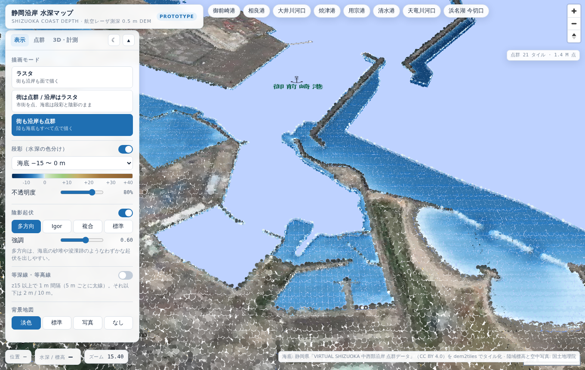
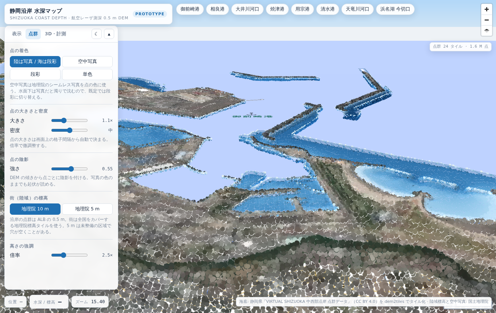

# 静岡沿岸 水深マップ（プロトタイプ）

静岡県の航空レーザ測深（ALB）0.5 m DEM を [dem2tiles](https://github.com/shiwaku/dem2tiles) で
タイル化した標高タイルを使う、単体 HTML の地図アプリ。

`index.html` をブラウザで開くだけで動く（ライブラリは CDN、タイルは公開配信元から取得）。

## 描画モード

| モード | 街（陸域） | 沿岸（海底） |
| --- | --- | --- |
| ラスタ | 段彩・陰影の面 | 段彩・陰影の面 |
| 街は点群 / 沿岸はラスタ | **点群** | 段彩・陰影の面 |
| 街も沿岸も点群 | **点群** | **点群** |

点群は WebGL のカスタムレイヤーで描く。標高タイルを GPU テクスチャとして読み、
頂点シェーダで 1 画素 = 1 点に展開する。画面上の格子間隔から点の大きさを自動で決め、
格子のままだと縞が出るので実測の点群のように少し散らしている。

| 点群の設定 | 内容 |
| --- | --- |
| 着色 | 陸は写真 / 海は段彩（既定）・空中写真・段彩・単色 |
| 大きさ | 自動算出した間隔に対する倍率 0.4〜2.6 |
| 密度 | 低 / 中 / 高（タイルあたり 128² / 256² / 512² 点） |
| 陰影 | DEM の傾きから点ごとに陰影を付ける |
| 街の標高 | 地理院 10 m（全国）/ 5 m（整備済み区域） |
| 高さの強調 | 1〜6 倍 |

沿岸の点群は ALB の 0.5 m。街は全国をカバーする地理院標高タイルを使う。
空中写真は地理院のシームレス写真を点の色にするので、RGB 付き LiDAR 点群に近い見え方になる。





## 3D と計測

| 機能 | 説明 |
| --- | --- |
| 視点 | 真上 / 45° / 鳥瞰のプリセット、傾き・方位のスライダー、自動回転 |
| 3D 地形 | ラスタ表示を立体化（起伏 1〜8 倍） |
| 空とかすみ | 鳥瞰で水平線と大気を描く |
| 海面と潮位 | 潮位 −2〜+2 m。汀線が動き、干出する範囲が見える。海底は水面ごしに透ける |
| 喫水チェック | 潮位を踏まえ、指定した喫水より浅い海域を赤で示す |
| 断面 | 線を引くと水深プロファイル。距離・最深・最高・水没率・喫水未満の割合 |

## そのほか

- 段彩は 5 レンジ（海底 −15 / −30、海図風の等深帯、浅場 0.5 m 刻み、陸海）
- 陰影は多方向・Igor・複合・標準から選べる。多方向は海底の砂堆や浚渫跡を出しやすい
- 等深線・等高線は z15 以上で 1 m 間隔（5 m ごとに太線）
- カーソル位置の水深 / 標高を表示（ALB 優先、範囲外は地理院 10 m）
- 表示状態は URL のハッシュに入るので、そのまま共有できる
- ダーク / ライト、スマホ幅に対応

## データ

- 海底: 静岡県「[VIRTUAL SHIZUOKA 静岡県 中西部沿岸 点群データ](https://www.geospatial.jp/ckan/dataset/shizuoka-2025-pointcloud-alb)」
  ALB グリッドデータ（CC BY 4.0 / ODbL）。dem2tiles の Terrarium 出力（512 px、z5–17）
  - 既定の配信元 `https://shi-works.com/raster-tiles/pref-shizuoka/shizuoka-alb-terrarium/{z}/{x}/{y}.png`
- 陸域標高: 国土地理院 標高タイル（`dem_png` 10 m / `dem5a_png` 5 m、数値PNG形式）
- 空中写真・背景地図: 国土地理院 シームレス写真、淡色地図、標準地図

## 自分で作ったタイルで動かす

`?tiles=` と `?gsi=` でタイルの配信元を差し替えられる（相対パスでもよい）。

```bash
mkdir -p serve/tiles && ln -s /path/to/output/terrarium serve/tiles/shizuoka-alb-terrarium
cp index.html serve/ && cd serve && python3 -m http.server 8765
# http://127.0.0.1:8765/index.html?tiles=/tiles
```

## 既知の制約

- Terrain-RGB / Terrarium は「値なし」を表せないため、データの無い場所は 0 m（FILL）になっている。
  点群も段彩も 0 m を捨てて描いていないので、未測深の港内などは穴になる。
- 喫水チェックと潮位は静的な DEM の水深で、実際の潮汐・波浪・底質は考慮していない。
  航行判断には使わないこと。
- 等高線のラベルは MapLibre のデモ用フォントサーバーに依存している。
- 街の点群は地理院 5 m を選ぶと未整備の区域で穴が空く。既定の 10 m は全国をカバーする。
