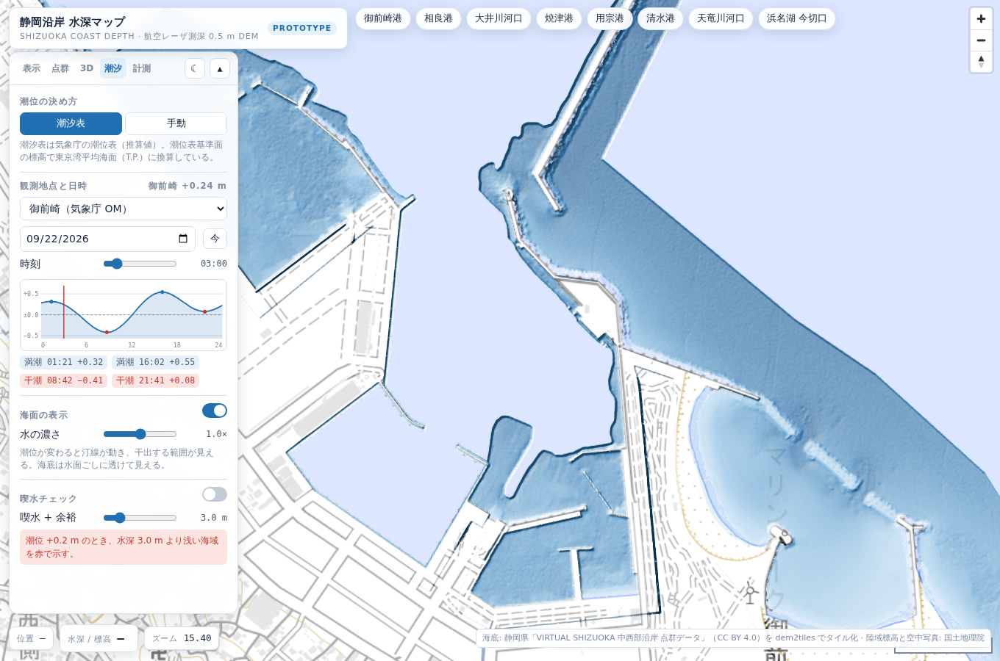
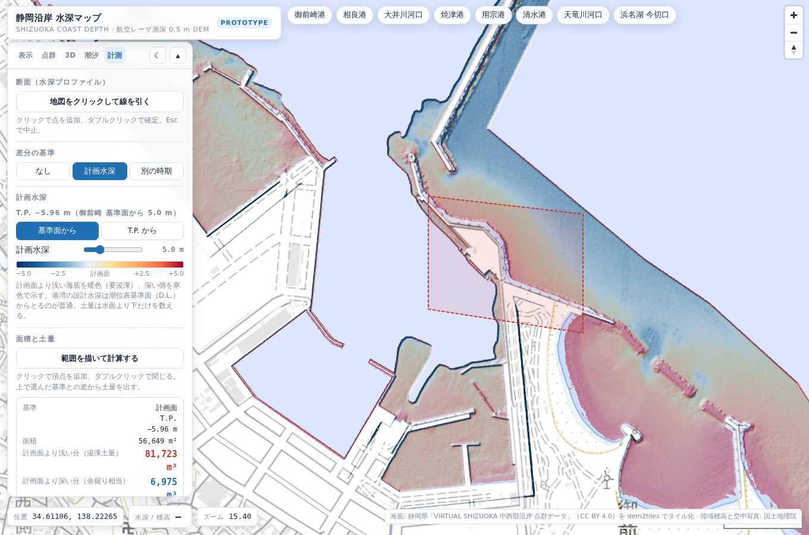

# 静岡沿岸 水深マップ（プロトタイプ）

静岡県の航空レーザ測深（ALB）0.5 m DEM を [dem2tiles](https://github.com/shiwaku/dem2tiles) で
タイル化した標高タイルを使う、単体 HTML の地図アプリ。

`index.html` をブラウザで開くだけで動く（ライブラリは CDN、タイルは公開配信元から取得）。

## 描画モード

| モード | 街（陸域） | 沿岸（海底） |
| --- | --- | --- |
| ラスタ | 段彩・陰影の面 | 段彩・陰影の面 |
| 街は点群 / 沿岸はラスタ | **点群** | 段彩・陰影の面 |
| 街も沿岸も点群 | **点群** | **点群** |

点群は WebGL のカスタムレイヤーで描く。標高タイルを GPU テクスチャとして読み、
頂点シェーダで 1 画素 = 1 点に展開する。画面上の格子間隔から点の大きさを自動で決め、
格子のままだと縞が出るので実測の点群のように少し散らしている。

| 点群の設定 | 内容 |
| --- | --- |
| 着色 | 陸は写真 / 海は段彩（既定）・空中写真・段彩・単色 |
| 大きさ | 自動算出した間隔に対する倍率 0.4〜2.6 |
| 密度 | 低 / 中 / 高（タイルあたり 128² / 256² / 512² 点） |
| 陰影 | DEM の傾きから点ごとに陰影を付ける |
| 街の標高 | 地理院 10 m（全国）/ 5 m（整備済み区域） |
| 高さの強調 | 1〜6 倍 |

沿岸の点群は ALB の 0.5 m。街は全国をカバーする地理院標高タイルを使う。
空中写真は地理院のシームレス写真を点の色にするので、RGB 付き LiDAR 点群に近い見え方になる。


## 3D

| 機能 | 説明 |
| --- | --- |
| 視点 | 真上 / 45° / 鳥瞰のプリセット、傾き・方位のスライダー、自動回転 |
| 3D 地形 | ラスタ表示を立体化（起伏 1〜8 倍） |
| 空とかすみ | 鳥瞰で水平線と大気を描く |

## 潮汐（気象庁の潮位表と連動）

気象庁の潮位表（推算値）をそのまま読み、選んだ日時の潮位を地図に反映する。

- 観測地点: 清水港・御前崎・舞阪。「自動」にすると地図の中心に近い地点へ切り替わる
- 日付と時刻（JST）を選ぶと、毎正時の値を Catmull-Rom で内挿して潮位を出す
- その日の潮位カーブ、満潮・干潮の時刻と潮位を表示。カーブを直接ドラッグして時刻を変えられる
- 潮位が変わると海面の高さ、汀線、喫水チェック、断面、水深の読み取りがすべて追従する

潮位表の値は**潮位表基準面**からの高さなので、掲載地点一覧表の「潮位表基準面の標高」を足して
**東京湾平均海面（T.P.）**に換算している。DEM の標高と同じ基準になるので、そのまま足し引きできる。

| 地点 | 記号 | 潮位表基準面の標高 |
| --- | --- | ---: |
| 清水港 | SM | T.P. −0.864 m |
| 御前崎 | OM | T.P. −0.965 m |
| 舞阪 | MI | T.P. −0.597 m |

喫水チェックは潮位を踏まえ、「潮位 − 喫水」より浅い海底を赤で示す。



## 計測・浚渫

| 機能 | 説明 |
| --- | --- |
| 断面 | 線を引くと水深プロファイル。距離・最深・最高・水没率・喫水未満の割合 |
| 計画水深との差分 | 設計水深を決めると、計画面より浅い海底を暖色（要浚渫）、深い側を寒色で表示 |
| 別の時期との差分 | 前の時期の標高タイルを指定すると、掘れた側・埋まった側を色分け |
| 面積と土量 | 範囲を描くと、選んだ基準との差から土量を出す |

**計画水深**は潮位表基準面（D.L.）からと東京湾平均海面（T.P.）からを選べる。港湾の設計水深は
基準面からとるのが普通なので、既定は基準面。地点の基準面標高を使って T.P. に直してから DEM と比べる。

**土量**は DEM の画素ごとに（標高 − 基準）を積み上げ、Web メルカトルの緯度補正を入れた
実面積を掛けて合計する。浚渫と水面下容積では水面より上の画素を除外し、除外した画素数も出す。
標本数が 300 万を超えないところまで自動でズームを下げる。



```
基準        計画面 T.P. −5.96 m
面積        56,649 m²
計画面より浅い分（浚渫土量）   81,723 m³
計画面より深い分（余掘り相当）   6,975 m³
最大の厚さ  6.51 / 1.77 m
標本        234,527 点 · z17
除外        陸域 105,441 · 欠測 125,831
```

## そのほか

- 段彩は 5 レンジ（海底 −15 / −30、海図風の等深帯、浅場 0.5 m 刻み、陸海）
- 陰影は多方向・Igor・複合・標準から選べる。多方向は海底の砂堆や浚渫跡を出しやすい
- 等深線・等高線は z15 以上で 1 m 間隔（5 m ごとに太線）
- カーソル位置の水深 / 標高を表示（ALB 優先、範囲外は地理院 10 m）
- 表示状態は URL のハッシュに入るので、そのまま共有できる
- ダーク / ライト、スマホ幅に対応

## データ

- 海底: 静岡県「[VIRTUAL SHIZUOKA 静岡県 中西部沿岸 点群データ](https://www.geospatial.jp/ckan/dataset/shizuoka-2025-pointcloud-alb)」
  ALB グリッドデータ（CC BY 4.0 / ODbL）。dem2tiles の Terrarium 出力（512 px、z5–17）
  - 既定の配信元 `https://shi-works.com/raster-tiles/pref-shizuoka/shizuoka-alb-terrarium/{z}/{x}/{y}.png`
- 陸域標高: 国土地理院 標高タイル（`dem_png` 10 m / `dem5a_png` 5 m、数値PNG形式）
- 空中写真・背景地図: 国土地理院 シームレス写真、淡色地図、標準地図
- 潮位: 気象庁 [潮位表](https://www.data.jma.go.jp/kaiyou/db/tide/suisan/index.php)
  （`txt/{年}/{地点記号}.txt`、CORS 許可あり）と
  [掲載地点一覧表](https://www.data.jma.go.jp/kaiyou/db/tide/suisan/station.php) の基準面標高

## 自分で作ったタイルで動かす

`?tiles=`・`?gsi=`・`?tide=` で配信元を差し替えられる（相対パスでもよい）。

```bash
mkdir -p serve/tiles && ln -s /path/to/output/terrarium serve/tiles/shizuoka-alb-terrarium
cp index.html serve/ && cd serve && python3 -m http.server 8765
# http://127.0.0.1:8765/index.html?tiles=/tiles
```

## 既知の制約

- Terrain-RGB / Terrarium は「値なし」を表せないため、データの無い場所は 0 m（FILL）になっている。
  点群も段彩も 0 m を捨てて描いていないので、未測深の港内などは穴になる。
- 喫水チェックと潮位は静的な DEM の水深で、実際の潮汐・波浪・底質は考慮していない。
  航行判断には使わないこと。
- 等高線のラベルは MapLibre のデモ用フォントサーバーに依存している。
- 街の点群は地理院 5 m を選ぶと未整備の区域で穴が空く。既定の 10 m は全国をカバーする。
- 潮位は気象庁の推算値で、気圧や風による偏差は入っていない。潮位表は当年分しか公開されない。
- 潮位表基準面は測地成果の改定で変わる。この値は 2026 年の掲載地点一覧表による。
- 土量は DEM をそのまま積み上げたもので、測量精度・欠測・浚渫余裕幅は考慮していない。
  積算や発注の根拠には使えない。
- 「別の時期」との差分は 2 つのタイルを同じ XYZ 格子で重ねる。地理院標高タイルを指定した場合、
  海域はデータがないので陸域だけの比較になる。
