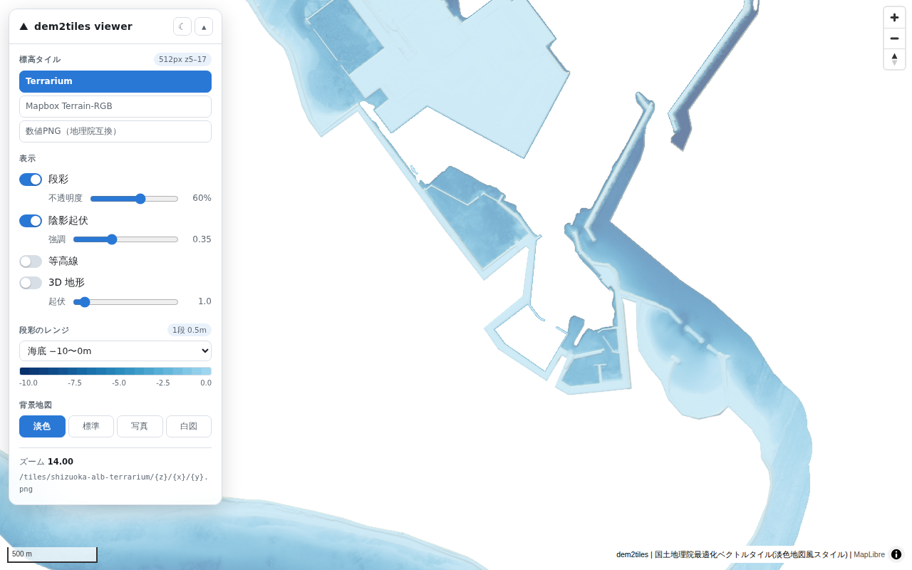
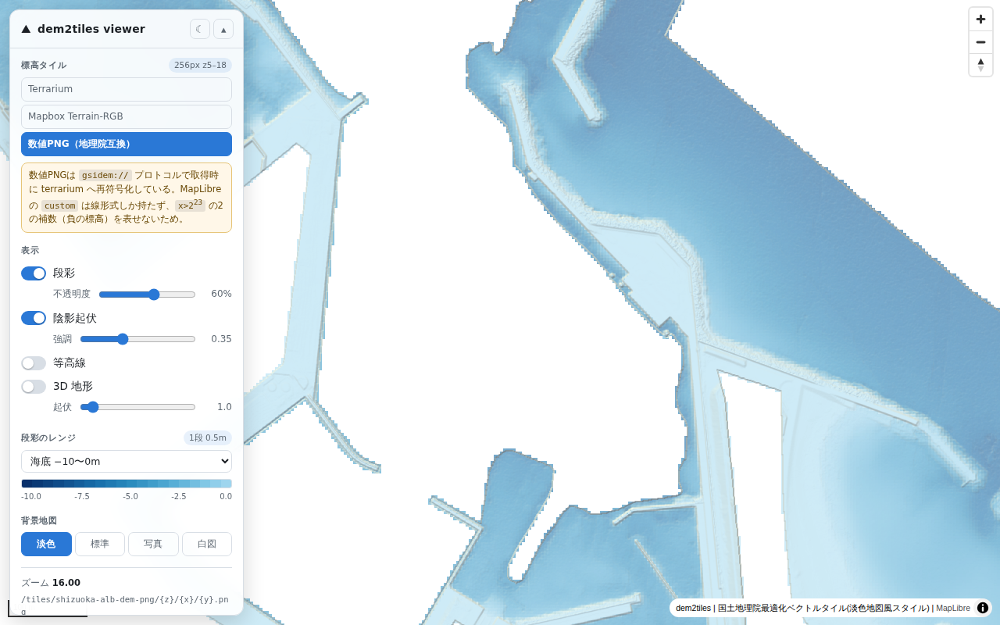

# dem2tiles 検証レポート（静岡県 中西部沿岸 ALB DEM）

[shiwaku/dem2tiles](https://github.com/shiwaku/dem2tiles) を、静岡県の航空レーザ測深（ALB）
グリッドデータ **1,164 図郭すべて** で実行し、README の記載と出力の正しさを検証した。

| 項目 | 内容 |
| --- | --- |
| 検証日 | 2026-09-21 |
| dem2tiles | `37c8ab4` (2026-09-21, Merge pull request #13 from shiwaku/feat/publish-viewer) |
| grid2geotiff | `c4ddeb7` (2026-09-21, Merge pull request #17 from shiwaku/docs/split-readme) |
| 入力データ | [VIRTUAL SHIZUOKA 静岡県 中西部沿岸 点群データ](https://www.geospatial.jp/ckan/dataset/shizuoka-2025-pointcloud-alb) の「ALBデータ グリッドデータ」（グラウンドデータを 0.5m グリッドに整理した DEM、CC BY 4.0 / ODbL） |
| 実行環境 | Ubuntu 24.04、4 vCPU、15.7 GB RAM、Docker 29.3.1（イメージ内 GDAL 3.8.4 / rasterio 1.5.1） |

## 結論

- **全 1,164 図郭が最後まで通り、3 形式のタイルがすべて生成された。** README の実測値（3,460 枚、merged.tif 613 MB、出力 222,948 × 101,654 px、RGB 系 5 分）と一致する。
- **3 形式とも復号値が元 DEM と一致する。** 有効画素の 94〜98% が符号化分解能（0.1 m）以内、99% 以上が 0.5 m 以内、平均バイアスは ±0.005 m 以内で位置ずれもない。差が出る画素は急斜面（護岸・岸壁）に限られ、リサンプリング（bilinear と最近傍）の違いで説明できる。
- **負の標高（水面下、最小 -14.5 m）が 3 形式とも正しく符号化される。** 数値 PNG の 2 の補数表現、Terrain-RGB / Terrarium のオフセットとも問題ない。
- **無効値の扱いが仕様どおり。** 数値 PNG は `RGB(128,0,0)` が merged.tif の NoData と画素単位で完全一致（不一致 0）。RGB 系は `FILL_VALUE=0` に置換される。
- **`tile_driver.py` の絞り込みは漏れがない。** 数値 PNG（NoData 保持ラスタから生成）にあって RGB 系に無いタイルは全ズームで 0 枚。
- **再実行のスキップ・部分再構築・`FORCE`・座標系混在の拒否がすべて README どおり動く。**

改善余地として見つかったのは次の 3 点（詳細は「所見と提案」）。

1. RGB 系の最大ズーム z17 で **2,186 枚中 259 枚（12%）が全画素 FILL の空タイル**。図郭の外接矩形で列挙しているため、図郭内の NoData 領域だけに当たるタイルが残る。
2. **ログが 27,711 行**あり、うち 6,920 行が rasterio の `NotGeoreferencedWarning`、13,844 行が mb-util の DEBUG。
3. mbtiles の `metadata` に `bounds` / `minzoom` / `maxzoom` / `name` が無い。

## 手順

### 1. データの取得と GeoTIFF 化

ダウンロード URL は配布ページのベクトルタイル（`{z}/{x}/{y}.pbf`）の属性 `URL` に入っている。
grid2geotiff に同梱の URL 一覧（`testdata/urllist-shizuoka-alb.txt`、1,164 件）が、
データセットの「ファイルリスト」（`file_itiran_grd.txt`、1,164 件）と完全一致することを確認したうえで使った。

```console
$ python scripts/fetch_shizuoka_alb.py --list testdata/urllist-shizuoka-alb.txt --out data/raw -j 8
完了: data/raw  1164/1164 件  988 MB

$ grid2geotiff convert data/raw -o data/out --columns 1,2,3 -j 4
変換: 成功 1164 / 失敗 0 / 計 1164      # 43 秒、出力 124 MB
```

| 入力の統計 | 値 |
| --- | --- |
| 座標系 | 1,164 件すべて EPSG:6676（図郭番号から判定） |
| 格子間隔 | 1,164 件すべて 0.5 m |
| 1/50000 図郭 | ND 115 / NE 206 / OB 84 / OC 270 / OD 267 / PC 22 / PD 200 |
| 欠損率 | 最小 0.00% / 中央 31.22% / 最大 95.66% |
| 標高 | -14.5 〜 124.4 m（有効セルの 69% が負値 = 水面下） |
| 有効セル | 246,456,840（61.6 km²） |
| 外接矩形 | 107.0 × 58.9 km |

外接矩形と有効面積は README の「1164 図郭、外接矩形 107 x 58.9 km、有効データ 61.6 km2」と一致する。

### 2. dem2tiles の実行

```console
$ docker build -t dem2tiles .
$ docker run --rm -v $PWD/data/out:/input:ro -v $PWD/output:/output dem2tiles
```

この検証環境は egress プロキシで TLS を再終端するため、`docker build` 内の `git clone` が
CA を信頼できず失敗した。**Dockerfile 本体には手を入れず**、CA を追加したベースイメージ
（`scripts/Dockerfile.ca-base`）を `ubuntu:24.04` の代わりに `FROM` するだけの
`Dockerfile.ccr` を作ってビルドした。dem2tiles 側の問題ではない。

ログ全文（警告行を除く）は `results/run1_full.log`。

```
[dem2tiles] found 1164 GeoTIFF(s) under /input
[dem2tiles] source CRS: EPSG:6676, pixel size: 0.500000 m, centre latitude: 35.035738
[dem2tiles] RGB_MAX_ZOOM=auto -> 17 (512 px tiles)
[dem2tiles] GSIDEM_MAX_ZOOM=auto -> 18 (256 px tiles)
[dem2tiles] merging 1164 GeoTIFF(s)
[dem2tiles] reprojecting EPSG:6676 -> EPSG:4326
Creating output file that is 222948P x 101654L.
[dem2tiles] replacing nodata (-9999) with 0
[dem2tiles] building mapbox tiles (z5-17)
tile_driver: 3460 tile(s) intersect the inputs (z5-17)
[dem2tiles] building terrarium tiles (z5-17)
tile_driver: 3460 tile(s) intersect the inputs (z5-17)
[dem2tiles] building gsidem tiles (z5-18)
[dem2tiles] done
```

## 結果

### 所要時間（4 vCPU、JOBS=4）

`output/.state/` のマーカーの更新時刻から求めた。

| ステップ | 所要 | README の記載 |
| --- | ---: | --- |
| merge + 再投影（gdalwarp） | 218 s | 150 s |
| NoData 置換（gdal_calc） | 210 s | – |
| mapbox（rio-rgbify + mb-util） | 325 s | 5 分 |
| terrarium（rio-terrarium + mb-util） | 332 s | 5 分 |
| gsidem（gdal2NPtiles） | 510 s | – |
| **合計** | **1,595 s（26.6 分）** | |

再投影が README より遅いのは CPU 数の差（README の計測環境は JOBS=12 程度と推測）で、
`TILED=YES + SPARSE_OK=TRUE` の効果（ストリップ型では 18 分で進まない）は再現できている。

### 出力の大きさと枚数

| 出力 | 枚数 | 容量 | README の記載 |
| --- | ---: | ---: | --- |
| `merged.tif` | – | 585 MiB（613,365,978 B） | 613 MB |
| `merged_filled.tif` | – | 585 MiB | – |
| `mapbox`（z5–17、512 px） | 3,460 | 108 MiB | 3,460 枚 |
| `terrarium`（z5–17、512 px） | 3,460 | 323 MiB | 3,460 枚 |
| `gsidem`（z5–18、256 px） | 9,017 | 248 MiB | – |
| 3 形式合計 | | **679 MiB（712 MB）** | 715 MB |

ズーム別の枚数は `results/tileset.json`。mapbox と terrarium のタイル集合は全ズームで同一。
mbtiles の `tiles` テーブルの行数（3,460）と展開ディレクトリの枚数も一致する。

`merged.tif` は 512×512 ブロック・DEFLATE・NoData -9999・Float32、画素 0.0000052636°
（約 0.485 m）で README の説明どおり。

### 最大ズームの自動決定

0.5 m グリッド・緯度 35.0° で `RGB_MAX_ZOOM=17`（512 px）、`GSIDEM_MAX_ZOOM=18`（256 px）。
README の表（z17 512 px = 0.485 m/px、z18 256 px = 0.485 m/px）と一致する。
出力 PNG のサイズも mapbox / terrarium が 512×512、gsidem が 256×256 の RGB だった。

### 復号の正しさ（merged.tif との比較）

`scripts/decode_check.py`。各形式・各ズームからタイルを 60 枚ランダムに選び、
1 枚あたり 4,096 画素の中心座標で `merged.tif`（EPSG:4326）を最近傍参照して差をとった。

| 形式 | ズーム | 有効画素 | 平均 \|d\| | 99 パーセンタイル | 0.1 m 以内 | 0.5 m 以内 | 復号値の範囲 |
| --- | ---: | ---: | ---: | ---: | ---: | ---: | --- |
| mapbox | 17 | 126,881 | 0.029 m | 0.15 m | 98.0% | 99.8% | -8.3 〜 11.7 m |
| terrarium | 17 | 126,881 | 0.021 m | 0.14 m | 98.3% | 99.8% | -8.3 〜 11.7 m |
| gsidem | 18 | 139,889 | 0.022 m | 0.20 m | 97.3% | 99.8% | -9.4 〜 13.0 m |
| gsidem | 17 | 105,665 | 0.035 m | 0.35 m | 95.4% | 99.4% | -12.0 〜 68.2 m |
| mapbox | 13 | 15,665 | 0.159 m | 2.31 m | 73.4% | 93.8% | -12.9 〜 75.7 m |
| gsidem | 13 | 15,608 | 0.153 m | 1.83 m | 67.5% | 94.1% | -13.9 〜 69.5 m |
| terrarium | 10 | 254 | 0.873 m | 7.23 m | 23.6% | 61.8% | -7.3 〜 9.8 m |

符号化分解能は Terrain-RGB が 0.1 m、Terrarium が 1/256 m、数値 PNG が 0.01 m なので、
「0.1 m 以内」が量子化誤差の目安になる。

z13 以下で差が広がるのは比較方法の限界で、欠陥ではない。z13 は 1 画素が約 8 m（元の 16×16 セル）を
平均した値なのに対し、この検証は画素中心の 1 セルを最近傍で参照している。gdal2NPtiles は
数値に戻してから `average` で縮小し（ログ `Resampling method for numerical overview tiles: average`）、
rio 系は bilinear で縮小するので、起伏のある場所ほど 1 セルの値との差が出る。低ズームでも
復号値の範囲（-13.9 〜 75.7 m）が入力の範囲（-14.5 〜 124.4 m）に収まり、負値も保たれている。

無効値の対応:

- gsidem z18: merged.tif が NoData の 105,871 画素すべてがタイルでも無効値 `x = 2^23`、不一致 **0 画素**
- mapbox / terrarium z17: merged.tif が NoData の 118,879 画素のうち 198 / 209 画素（0.17%）が FILL(0) でない。
  データ縁で bilinear が隣接する有効画素と混ざったもの（「所見と提案」参照）

### 復号の正しさ（再投影前の元 GeoTIFF との直接比較）

`scripts/origin_check.py`。`merged.tif` を経由せず、タイル画素中心 → EPSG:6676 に変換して
図郭 GeoTIFF の VRT を直接参照した。再投影・タイル化を含めた全工程の位置ずれを見る。

| 形式 | ズーム | 有効画素 | 平均 \|d\| | 平均バイアス | 0.1 m 以内 | 0.5 m 以内 |
| --- | ---: | ---: | ---: | ---: | ---: | ---: |
| mapbox | 17 | 66,573 | 0.036 m | +0.001 m | 97.3% | 99.3% |
| terrarium | 17 | 66,573 | 0.044 m | -0.001 m | 94.0% | 99.3% |
| gsidem | 18 | 97,500 | 0.041 m | -0.005 m | 94.5% | 99.4% |
| gsidem | 15 | 36,331 | 0.093 m | -0.006 m | 79.2% | 97.5% |

平均バイアスがほぼ 0 なので、半画素ずれのような系統誤差はない。

### 大きな差の正体

`scripts/slope_check.py`。差が 0.1 m を超える画素について、元 DEM の 3×3 近傍の起伏
（max − min）と比べた。差が局所起伏を超える画素だけが「リサンプリングでは説明できないずれ」になる。

| 形式 | ズーム | 内部画素 | \|d\| > 0.1 m | うち局所起伏を超える | 説明できない差の最大 | 局所起伏の中央値（差が大きい画素 / 全体） |
| --- | ---: | ---: | ---: | ---: | ---: | --- |
| mapbox | 17 | 38,460 | 1,326 | **1**（0.003%） | 0.30 m | 1.40 m / 0.20 m |
| gsidem | 18 | 58,993 | 2,785 | **1**（0.002%） | 0.22 m | 0.60 m / 0.20 m |

差が 0.1 m を超える画素は、元 DEM の 3×3 近傍で中央値 0.6〜1.4 m の起伏がある場所（護岸・岸壁・
航路の法面）に集中している。差が局所起伏を超えた画素は各 1 つで、その差も 0.3 m 以下。
**タイルの値は元 DEM の隣接セルの範囲内に収まっており、リサンプリング以外のずれはない。**
最大差（4.9 m）が出たタイル `17/115791/52070` などの一覧は `results/decode_worst_tiles.txt`。

### 再実行・部分再構築・検証の挙動

| 操作 | 結果 |
| --- | --- |
| 同じ設定で 2 回目（1,164 図郭） | 5 ステップすべて `up to date, skipping`、**2.4 秒**で終了（`results/run2_skip.log`） |
| `output/gsidem` を消して再実行 | gsidem だけ再構築、他はスキップ |
| `RGB_MAX_ZOOM=16` | mapbox と terrarium だけ z5–16 で再構築、gsidem はスキップ |
| `mapbox.mbtiles` だけ消す（マーカーは残る） | mapbox だけ再構築（マーカーだけでは「完了」とみなさない） |
| `FORCE=1` | 全ステップ再構築 |
| `OUTPUTS=gsidem` | `merged_filled.tif` を作らず gsidem のみ生成 |
| EPSG:6676 2 件 + EPSG:6677 1 件を混ぜる | `probe: inputs are in more than one CRS, refusing to merge` で exit 1、`merged.vrt` を作らない（`results/mixed_crs.log`） |

部分再構築の 5 件は 1 図郭の出力で確認した（全量では 1 回 5〜9 分かかるため）。

### viewer での目視確認

同梱の `viewer/`（MapLibre）を `npm run dev` で起動し、Playwright で 3 形式を切り替えて撮影した
（`scripts/viewer_screenshots.mjs`）。背景地図（地理院最適化ベクトルタイル）は検証環境の
Chromium が外部 CA を信頼できず読めていないため白地になっているが、標高タイルはローカル配信で
問題なく描画される。

| 場所 | 形式 | 画像 |
| --- | --- | --- |
| 御前崎港 z14 | Terrarium | `images/omaezaki-terrarium.png` |
| 御前崎港 z14 | Terrain-RGB | `images/omaezaki-mapbox.png` |
| 御前崎港 z14 | 数値 PNG | `images/omaezaki-gsidem.png` |
| 御前崎港 z16 | 数値 PNG | `images/omaezaki-z16-gsidem.png` |
| 浜名湖 今切口 z13 | Terrain-RGB | `images/hamamatsu-lake-mapbox.png` |
| 全体 z10 | 数値 PNG | `images/overview-gsidem.png` |





- 3 形式で段彩（海底 -10〜0 m）と陰影が同じ地形を描く。防波堤・航路・泊地の水深差が読める
- 数値 PNG は viewer が `gsidem://` で terrarium に再符号化して表示しており、負の標高が正しく出る
- 3 形式のスクリーンショットは見分けがつかないほど同じ。RGB 系の FILL（0 m）はこの段彩レンジ
  （海底 -10〜0 m）では最上端＝ほぼ白になり、数値 PNG の無効値（透過）と同じ見た目になるため、
  この表示では FILL の影響は現れない（陸域を含むレンジや陰影の縁で現れる。「所見と提案 2」）

## 所見と提案

### 1. 図郭の外接矩形による列挙が、空タイルを 332 枚残す

`tile_driver.py` は各図郭 GeoTIFF の `bounds` からタイルを列挙する。ALB の図郭は
海域側が大きく欠けている（欠損率の中央値 31%、最大 96%）ので、図郭の矩形には入るが
有効画素が 1 つも届かないタイルが残る。

| ズーム | RGB 系タイル | うち全画素 FILL | 数値 PNG（NoData 保持）のタイル |
| ---: | ---: | ---: | ---: |
| 15 | 289 | 13 | 276 |
| 16 | 756 | 54 | 702 |
| 17 | 2,186 | **259** | 1,924 |
| 合計（z5–17） | 3,460 | **332（9.6%）** | 3,128 |

容量への影響は小さい（空タイルは 1 枚 2 KB 弱、合計 0.6 MB）が、枚数と生成時間の 1 割が
無駄になっている。README の「機械的に列挙すると 136,148 枚」からは十分に減っているので、
これは残りの 1 割の話。

**提案:** 列挙のもとを図郭の矩形ではなく **有効画素の有無** にする。`merged.tif` は
`SPARSE_OK` で NoData ブロックを持たないので、`rasterio` の `block_windows` で実ブロックの
位置だけを拾えば、512 px ブロック単位のフットプリントが再投影後の座標で安価に得られる。
これを `mercantile.tiles` に渡せば、gdal2NPtiles と同じ集合（z17 で 1,924 枚）に揃う。
別案として、図郭ごとに `dataset_mask()` の有効範囲の外接矩形に縮めるだけでも、
海域側が欠けた図郭では効く。

### 2. `FILL_VALUE=0` は水深データでは「海面」と紛れる

Terrain-RGB / Terrarium は「値なし」を表せないので NoData を `FILL_VALUE` で埋めるしかない。
既定の 0 は陸域 DEM では自然だが、ALB は有効セルの 69% が負値（海底）で、
FILL の 0 m は周囲の海底（-5〜-14 m）より **高い**。段彩ではデータの無い海域が
「浅い帯」に見え、陰影では FILL との境界が崖になる。

さらに、bilinear で再投影する前に置換するため（`merged_filled.tif` を作ってからタイル化）、
データ縁の画素が 0 と混ざる。上の検証で RGB 系の NoData 画素の 0.17% が FILL 以外の値を
持っていたのはこれで、逆に縁の有効画素も 0 側に引かれる。

**提案（どちらか、または両方）:**

- ALB のような水深を含むデータでは `FILL_VALUE` を **データ範囲より低い値**（例 `-100`）にする
  運用を README に書く。viewer の段彩レンジで FILL を範囲外に落とせるようになる
- RGB 系を `merged.tif`（NoData 保持）からタイル化し、**タイル化後に** NoData 画素を
  FILL に置く。rio-rgbify / rio-terrarium は `nodata` を見ないので、`tile_driver.py` で
  `_encode_as_png` を差し替えて mask を見るのが一案。これなら縁の混色が消える

現状の挙動自体は README の説明（「Terrain-RGB と Terrarium には値なしを表す方法がない」）と
矛盾しないので、仕様として明記されていれば十分とも言える。

### 3. 座標系のラベル: データは「日本測地系2024」、出力は EPSG:6676（JGD2011）

データセットの説明は「日本測地系2024／平面直角座標系第8系」だが、grid2geotiff は
図郭番号から JGD2011 の EPSG:6676 を付与し、dem2tiles もそれを受ける。

測地成果2024 は **測地系の定義を変えるものではなく、水平位置の数値は JGD2011 から引き継ぐ**
（[国土地理院](https://www.gsi.go.jp/sokuchikijun/datum-main.html)）。したがって
EPSG:6676 で再投影しても **位置はずれない**。JGD2024 の EPSG コードは
2026 年 4 月の EPSG v12.055 で登録された（[Qiita: EPSG に登録された JGD2024](https://qiita.com/tohka383/items/df184ae9860b7af4a63c)）が、
イメージ内の GDAL 3.8.4 / PROJ はまだ持っていないため、当面は EPSG:6676 のままでよい。

**提案:** README の「入力の検証」に「JGD2024 表記のデータは JGD2011 の EPSG で扱ってよい
（数値は同じ）」と一言あると、利用者が `--crs` を探さずに済む。

### 4. ログの 4 分の 3 が警告と DEBUG

| 種類 | 行数 |
| --- | ---: |
| 全体 | 27,711 |
| rasterio `NotGeoreferencedWarning`（タイル 1 枚ごとに 2 行） | 6,920 |
| mb-util の `DEBUG:` / `INFO:`（タイル 1 枚ごとに 2 行） | 13,844 |

前者は rio-rgbify / rio-terrarium が PNG を `MemoryFile` に書くときの警告で無害。
後者は mb-util がログレベルを DEBUG に固定しているため。

**提案:** `docker_entrypoint.sh` で `export PYTHONWARNINGS="ignore::rasterio.errors.NotGeoreferencedWarning"`
（venv 側の python に効く）と、`mb-util --silent`（mbutil に `--silent` オプションがある）を付ける。
これで進捗行だけが残り、`docker logs` が読めるようになる。

### 5. mbtiles の metadata が空

`mapbox.mbtiles` / `terrarium.mbtiles` の `metadata` は
`format=png, name="", description="", version=1, type=baselayer` だけで、
`bounds` / `minzoom` / `maxzoom` が無い。展開して配信するだけなら困らないが、
mbtiles のまま tileserver-gl や PMTiles に渡すと範囲とズームを推定させることになる。

**提案:** `tile_driver.py` は `keep` の集合を持っているので、生成後に `metadata` へ
`bounds`（`mercantile.bounds` の合併）、`minzoom`、`maxzoom`、`name`（`mapbox` / `terrarium`）を
書き足せる。数行で済む。

### 6. 細かい点

- `probe.py` の `centre latitude` は **先頭の 1 ファイル**の中心緯度（35.036°）で、
  データ全体の中心（約 34.85°）ではない。ズームの決定には効かない（どちらでも z17 / z18）が、
  南北に長いデータでは端で 1 段ずれる可能性がある。`probe.py` は全ファイルを開いているので、
  全体の bounds から求めるのが自然。
- `RGB_MAX_ZOOM` を明示したとき `RGB_MAX_ZOOM=auto ->` の行が出ないので、
  ログからは何ズームで作ったか分からない。`building mapbox tiles (z5-16)` の行で分かるので実害はない。
- `gsidem` の中に gdal2NPtiles のビューア（`leaflet.html` など 4 ファイル）が残る。README に
  書いてあるとおりだが、配信用にそのまま同期すると混ざる。

## 再現方法

```bash
# 1. データ
git clone https://github.com/shiwaku/grid2geotiff && pip install -e grid2geotiff
python grid2geotiff/scripts/fetch_shizuoka_alb.py \
    --list grid2geotiff/testdata/urllist-shizuoka-alb.txt --out data/raw -j 8
grid2geotiff convert data/raw -o data/out --columns 1,2,3 -j 4

# 2. タイル
git clone https://github.com/shiwaku/dem2tiles && docker build -t dem2tiles dem2tiles
docker run --rm -v $PWD/data/out:/input:ro -v $PWD/output:/output dem2tiles

# 3. 検証（rasterio / numpy / pillow が要る）
python scripts/tileset_check.py output
python scripts/decode_check.py --output output --kind gsidem --zoom 18 --samples 60
gdalbuildvrt -input_file_list <(sed 's#^/input/#data/out/#' output/input_files.txt) src6676.vrt
python scripts/origin_check.py --output output --vrt src6676.vrt --kind mapbox --zoom 17
python scripts/slope_check.py output src6676.vrt mapbox 17 40
```

## ファイル

| パス | 内容 |
| --- | --- |
| `scripts/decode_check.py` | 3 形式の復号と merged.tif との比較 |
| `scripts/origin_check.py` | 元 GeoTIFF（EPSG:6676）との直接比較 |
| `scripts/slope_check.py` | 差と局所起伏の関係 |
| `scripts/tileset_check.py` | タイル集合の整合性、mbtiles metadata、空タイル |
| `scripts/viewer_screenshots.mjs` | viewer のスクリーンショット（Playwright） |
| `scripts/Dockerfile.ca-base` | 検証環境の CA を入れたベースイメージ（dem2tiles 本体は無変更） |
| `results/run1_full.log` | 本番実行のログ（警告行を除く） |
| `results/run2_skip.log` | 2 回目（全スキップ） |
| `results/mixed_crs.log` | 座標系混在の拒否 |
| `results/grid2geotiff_convert.log` | GeoTIFF 化のログ（抜粋） |
| `results/tileset.json` | ズーム別枚数、集合比較、mbtiles metadata |
| `results/allfill.json` | 全画素 FILL のタイル数 |
| `results/*.jsonl` | 復号検証の生データ |
| `images/` | viewer のスクリーンショット |
