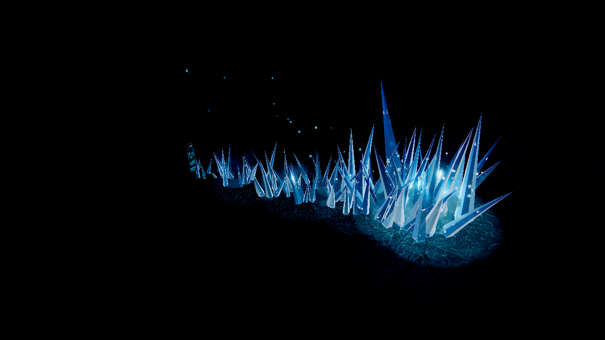
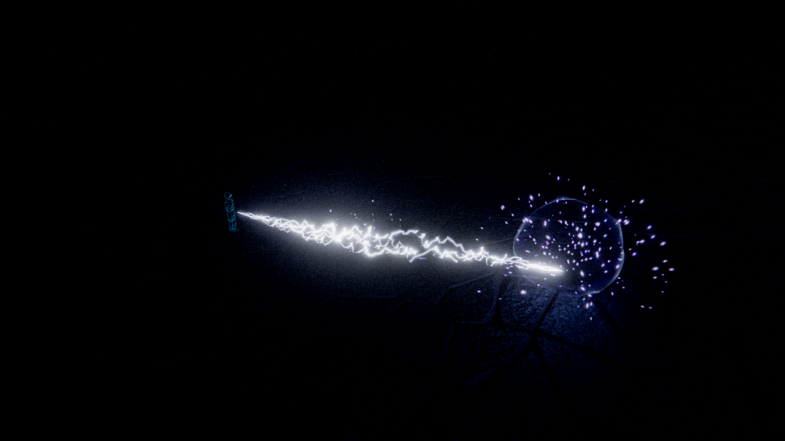
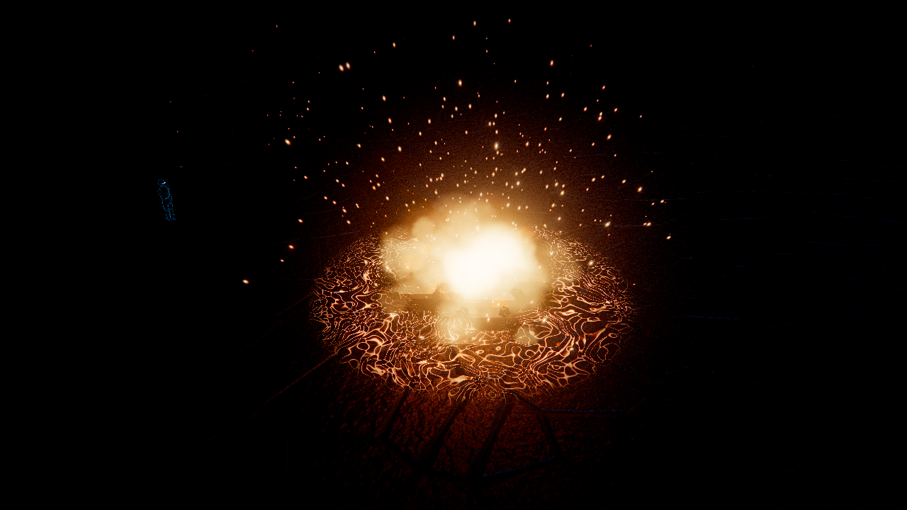
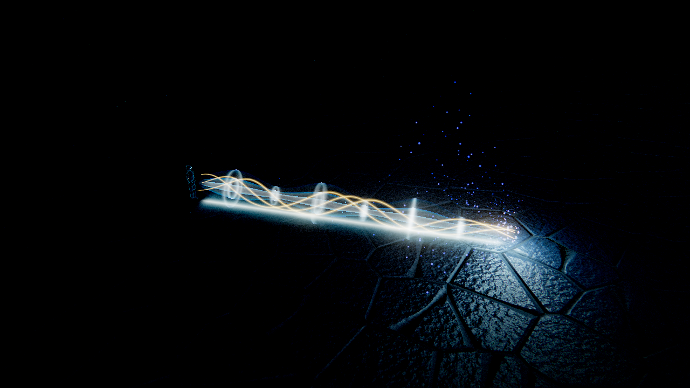
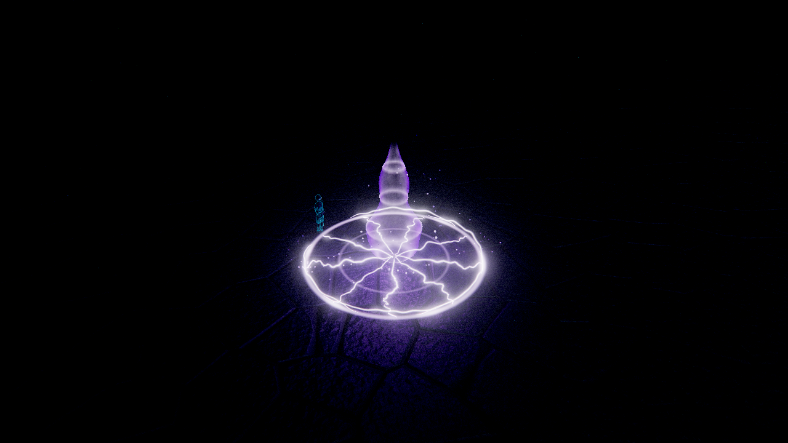
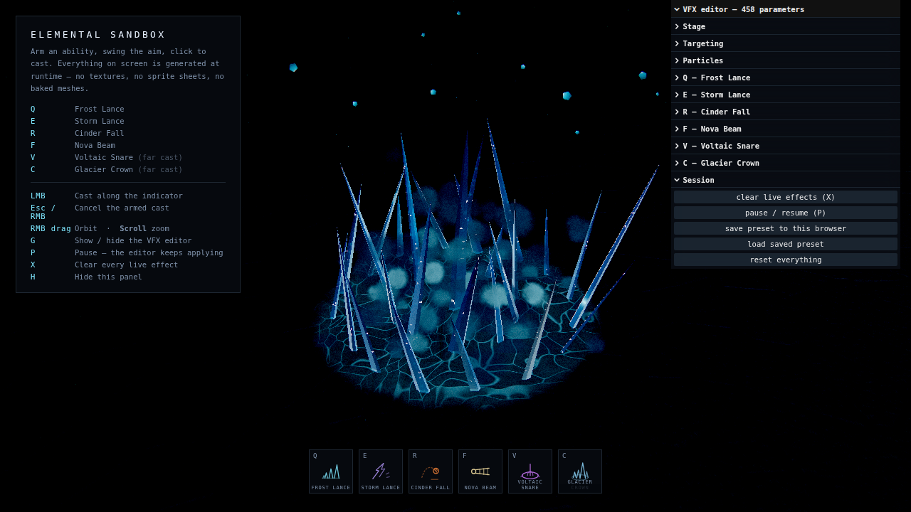

# Elemental Sandbox

A skillshot VFX playground built with **Three.js**, **Vite** and hand-written **GLSL**.

Six abilities and two ways to aim them. Four are **line casts**: press the key to arm, a
League-of-Legends style arrow appears on the ground and swings with the mouse, click to fire. The
other two are **far casts**: the arrow is replaced by a circle with a deliberately thick boundary
that follows the cursor and answers the only question a ground-targeted AoE has to answer before
you commit — how much space is this going to take.

**Q — Frost Lance.** A fracture front races out along the line while a field of ice crystals tears
up out of the floor behind it — small and dense at your feet, opening into a wall of blades at the
far end, with a cluster thrown up around the impact point.

**E — Storm Lance.** A bolt leaves the caster's hand and a bundle of lightning filaments is drawn
out behind the strike front, holds while it gutters and re-strikes, then blows out. Sparks come off
it the whole way, the floor underneath takes a branching electric burn and a dark scorch, and the
far end gets a shell of ionised air.

**R — Cinder Fall.** A burning rock is lobbed downrange on an arc, trailing a raymarched wake of
burning gas and heating up the whole way: the lava seams splitting its surface prise wider and
brighter as it comes in. It detonates on arrival, throws its own shattered chunks across the floor,
and tears the ground open into a network of molten cracks that keep glowing while the crater burns
out.

**F — Nova Beam.** The caster winds a ball of light up in one hand, pulling motes in out of the air,
then lets a column of it out along the line — white-hot core, cyan sheath, gold ribbons spiralling
around it and shock discs racing down it. It *holds* there, burning into the floor and throwing
spray back up the beam, before collapsing to a thread and blinking out. The only cast in the sandbox
that is still happening a second after it landed.

**V — Voltaic Snare.** The first far cast. A leash of current is whipped out across the floor, and
where it lands the ring snaps open past its own radius and pulls back onto it: a violet column tears
up out of the middle, tendrils crawl outward to the boundary, arcs run around the rim and the whole
disc burns. It holds there re-striking and hauling the air up into the pillar, then collapses to a
thread. The circle you measured out before the click is exactly the circle you get.

**C — Glacier Crown.** The second far cast. The circle you place is the footprint of a ring of
blades. They come up out of the floor in staggered rings — the outer ring first, leaning outward,
then the inner ring leaning in — with a single spire punched up through the middle a beat later. A
shock ring runs out under them and the disc rimes over.

**Everything you can see is generated.** There are no textures, no sprite sheets, no HDRIs and no
meshes on disk — not even the character. The crystals are lathed procedural geometry, the caster is
a hierarchy of capsules driven by a hand-written pose function, the bolt is a strip of ribbon placed
entirely by a vertex shader, the meteor is an icosphere cratered and sliced by fracture planes on
the CPU, the beam is a parametric tube drawn three times at three radii, the snare's whole cage is
that same ribbon strip threaded along three different parametric paths, the arrow, the targeting
circle, the rime, the burns and the molten cracks are signed-distance and noise shaders, the
reflection probe is a shaded dome baked into a PMREM chain at boot, and the mist, sparks, chips and
glitter are GPU particles.

**Every parameter is a live slider** — 458 of them — and they stay live while the simulation is
paused. That is the point of the project: freeze a frame mid-eruption, mid-strike or mid-burn with
**P**, then reshape the silhouette, the palette and the timing against a still image.

| | |
| --- | --- |
|  |  |
| **Q — Frost Lance** | **E — Storm Lance** |
|  |  |
| **R — Cinder Fall** | **F — Nova Beam** |
|  |  |
| **V — Voltaic Snare** | **C — Glacier Crown**, with the editor open |

*(Captured on a software rasteriser, so they run at a fraction of the framerate a GPU gives — the
frames are representative of the look, not the performance.)*

---

## Quick start

```bash
npm install
npm run dev
```

Then open the URL Vite prints (default <http://127.0.0.1:5173>).

```bash
npm run build
npm run preview
```

There is nothing to download and no `public/` directory. The first frame costs a few hundred
milliseconds of shader compilation and geometry generation; after that nothing is ever loaded.

---

## Controls

| Input | Action |
| --- | --- |
| **Q** (or **1**) | Arm Frost Lance — press again to put it away |
| **E** (or **2**) | Arm Storm Lance |
| **R** (or **3**) | Arm Cinder Fall |
| **F** (or **4**) | Arm Nova Beam |
| **V** (or **5**) | Arm Voltaic Snare — far cast, aimed with a circle |
| **C** (or **6**) | Arm Glacier Crown — far cast |
| **Move the mouse** | Swing the aim arrow, or move the far-cast circle |
| **Left click** | Cast along the arrow, or drop the circle where it is |
| **Esc** / **right click** | Cancel an armed cast |
| **Right mouse + drag** | Orbit the camera |
| **Scroll** | Zoom |
| **G** | Show / hide the VFX editor |
| **P** | Pause / resume — *the editor keeps applying* |
| **X** | Clear all live effects |
| **H** | Hide the controls panel |

`range` and `minRange` are per ability, so the indicator's reach changes with the slot you have
selected. Aiming closer than the selected ability's `minRange` tints the indicator red and refuses
the cast; set `minRange` to 0 if you would rather cast at your own feet, which is what both far
casts ship with — a trap you cannot drop on yourself is missing half its uses. Cooldowns are per
ability too, so spending one slot never locks another out.

---

## How it works

### GPU particles, resolved in the vertex shader

The CPU never simulates a particle. It writes an origin, a launch velocity and a handful of
constants into a ring buffer once, at spawn, and then forgets about them. Where the particle *is*
this frame is solved in closed form in the vertex shader, integrating linear drag plus gravity:

```
v(t) = (v₀ + g/k)·e^(−kt) − g/k
p(t) = p₀ + (v₀ + g/k)·(1 − e^(−kt))/k − (g/k)·t
```

with a curl-noise field layered on top and a floor contact that settles rather than sinks. Nothing
is read back, no position buffer is ever re-uploaded, and pausing the simulation is nothing more
than freezing `uSimTime`.

Because drag, gravity, turbulence, size, lifetime and both colour stops are *per particle*, the five
systems are distinguished only by **shape and blend mode** — hard spark, soft glow, additive flame,
alpha-blended smoke, lit chip. Every ability picks a look and supplies its own physics.

### Blank geometry

Three of the topologies in `src/assets/ProceduralGeometry.js` contain no useful vertex positions at
all. The ribbon strip carries `aT` (along), `aSide` (across) and `aIndex` (which filament); the tube
carries `aT` and `aAngle`. The vertex shader is what puts them in the world — which is why the same
ribbon buffer becomes a lightning bolt, a gold helix around the beam, a tendril crawling across the
floor and an arc running around the snare's rim, by changing one `#define`.

The same trick drives the eruptions: a crystal's placement goes into an instance matrix once, and
the tear-out-of-the-floor, overshoot, hold and sink are a function of a per-instance birth time
evaluated in `IceMaterial`'s vertex half. Same for the meteor's shattered chunks, which solve their
own landing time and slide to a stop without a single matrix update.

### Ground decals

One quad, one shader, seven looks — rime, scorch, branching electric burn, molten crack network,
beam scar, snare disc, shock ring — all signed-distance and noise fields, pooled per type. A caller
gets its decal back and can keep driving `uProgress`, which is how a burn spreads with a travelling
front and how the molten crack network keeps opening after the blast has gone.

---

## Project layout

```
src/
  abilities/      Ability base class (pooled cast instances), the six abilities,
                  arming / cooldown manager
  assets/         Procedural crystal, shard, asteroid and chunk geometry; the
                  ribbon strip, the parametric tube, ground quads
  config/         settings.js — the single source of truth for every parameter
  core/           App, Renderer, CameraRig, Time (two clocks), shared frame uniforms
  effects/        Aim arrow, far-cast circle, ground decals, crystal field,
                  debris, burst shells, light pool
  input/          InputManager (events) and AimController (both targeting shapes)
  materials/      Ice, lightning ribbon, meteor, raymarched fire, beam tube
  particles/      GPU particle system + the engine that shares five of them
  postprocessing/ Composer pipeline, grade shader
  shaders/lib/    Shared GLSL: noise library, SDF + easing + colour helpers
  ui/             HUD, the auto-generated lil-gui editor, glyphs, styles
  utils/          Maths and seeded RNG, event emitter, disposal
  world/          Environment (stage lighting + PMREM probe), floor, dust, caster
```

### Checks

```bash
npm run build && npm run preview   # one terminal
npm run test:behaviour             # another
```

`test/behaviour.mjs` drives real keyboard and mouse events at the running app and then asks it what
state it is in — 22 assertions covering the rules that are easy to break and impossible to see in a
screenshot: arming and disarming, a cast inside `minRange` being refused without burning a cooldown,
cooldowns staying independent per slot, **P** freezing the simulation clock while the wall clock and
the editor keep running, **X** clearing every live effect, presets round-tripping, the far cast
clamping its circle to range, and the orbit/zoom bindings.

It runs headless on a software rasteriser, so it needs no GPU. Set `ES_URL` to point somewhere else
and `ES_CHROME` to use a specific Chromium build.

### The editor

`src/ui/Editor.js` walks `settings` and binds everything it finds: numbers become sliders,
`#rrggbb` strings become colour pickers, booleans become checkboxes. Adding a parameter to the
config is all it takes to get a control for it. Ranges are inferred from the shipped value, with
explicit overrides for the handful where that guess would be wrong.

A few controls are marked **⟳**: they are counts the geometry is *built* from (`segments`, `radial`,
`detail`, particle `budget`) and only take effect on reload. Everything else is live, including
while paused.

Presets save to `localStorage` under `elemental-sandbox:preset`.

---

## Credit

Built as an original implementation of the idea behind
[achrefelouafi/LinearAbiltyCastingThreeJS](https://github.com/achrefelouafi/LinearAbiltyCastingThreeJS) —
same product, same brief (line casts, a far cast, everything procedural, every parameter a slider),
independently written. No code or assets from that project are used here.
