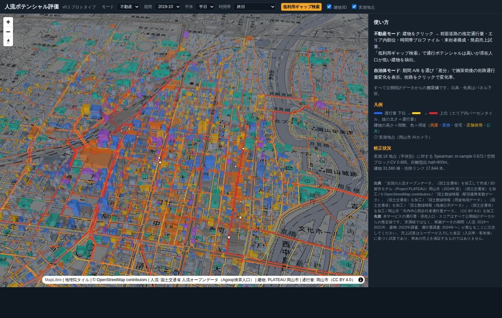
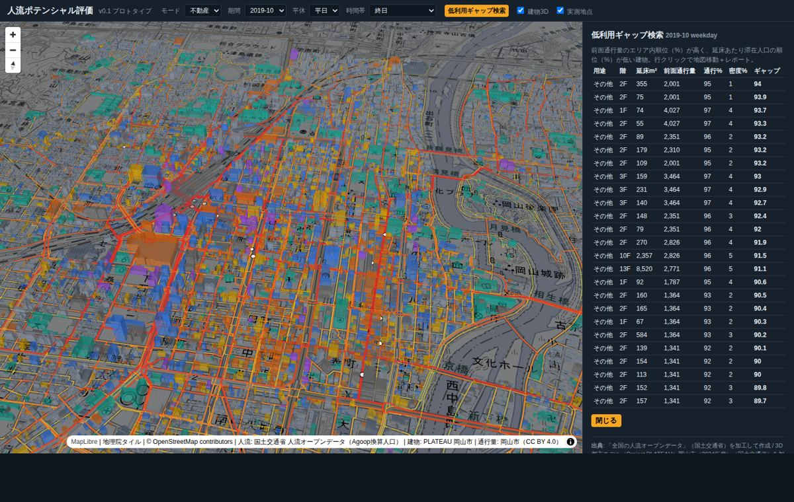
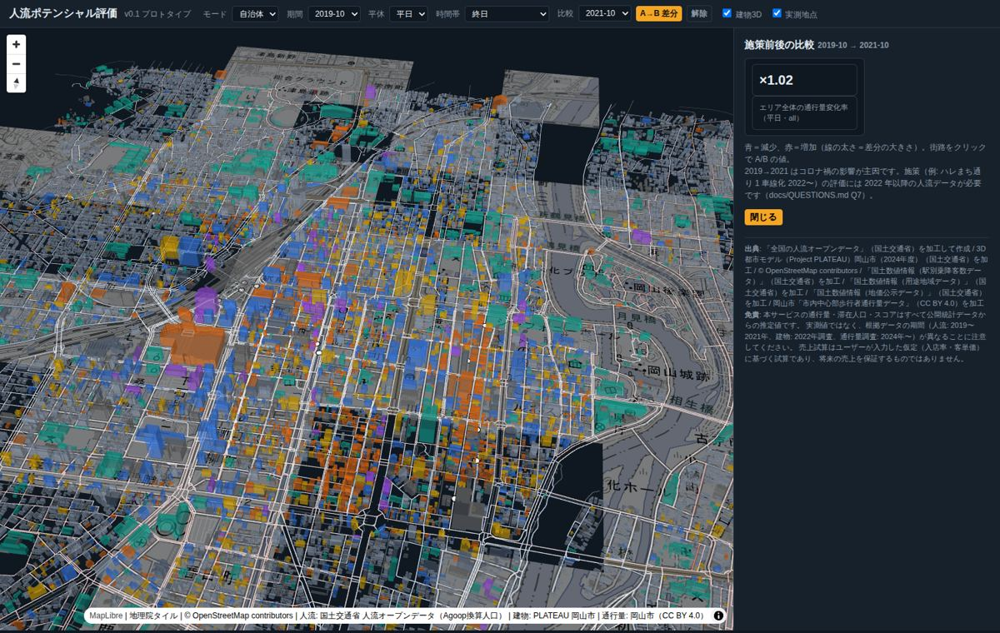
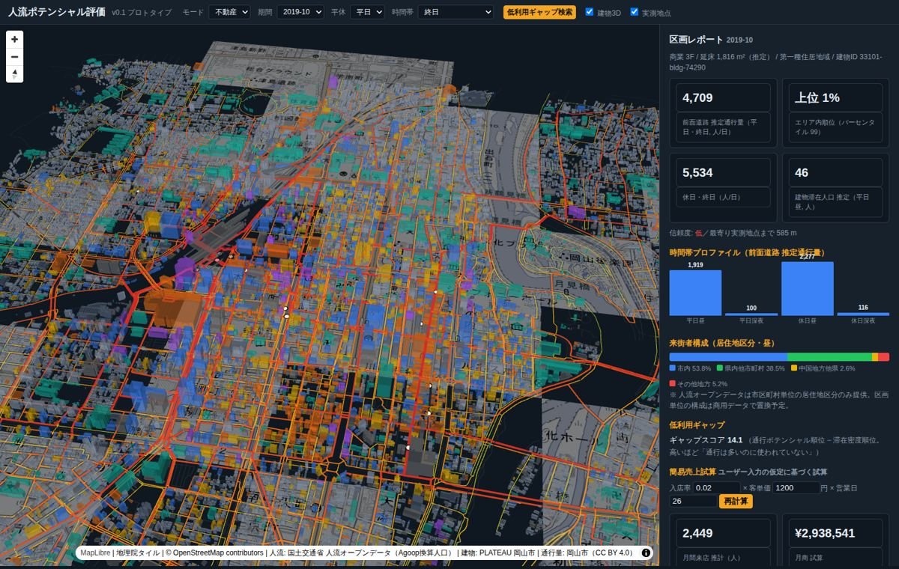

# jinryu-proto — 人流ポテンシャル評価プロトタイプ v0.1

メッシュ単位の広域人流データ（国交省 人流オープンデータ）を、PLATEAU 建物・OSM 道路リンクという「意思決定の単位」に再配分し、
不動産・自治体が使える言葉（通行量・来街者構成・施策効果）で返すエンジンのプロトタイプ。対象エリア: 岡山市中心部。

仕様: [docs/SPEC.md](docs/SPEC.md) ／ 進捗: [docs/PROGRESS.md](docs/PROGRESS.md) ／ 評価: [docs/EVAL.md](docs/EVAL.md) ／ 未決事項: [docs/QUESTIONS.md](docs/QUESTIONS.md) ／ デモ台本: [docs/DEMO_SCRIPT.md](docs/DEMO_SCRIPT.md)



| 低利用ギャップ検索（UC-R2） | 期間比較（UC-G1） | 区画レポート（UC-R1） |
|---|---|---|
|  |  |  |

## クイックスタート（同梱デモデータで起動）

```bash
cd jinryu-proto
make setup          # uv sync
make demo           # http://localhost:8000/  （data/demo の処理済みデータで起動）
```

- 不動産モード: `http://localhost:8000/?mode=realestate`
- 自治体モード（期間比較）: `http://localhost:8000/?mode=gov&period=2019-10&periodB=2021-10&demo=compare`

## フルパイプライン（オープンデータ取得から）

```bash
make fetch          # 人流・国土数値情報・OSM・PLATEAU(部分取得)・岡山市通行量 → data/raw
make ingest         # → data/processed/*.parquet
make build          # ① 建物配分 → ② OD → ③ 経路配分
make calibrate      # ④ 較正・評価 → docs/EVAL.md
make score          # ⑤ parcel_score
make serve          # API + UI
make test           # pytest
```

## 構成

```
config/         area.yaml（対象エリア）, coefficients.yaml（α・β・距離抵抗など）, sources.yaml（出典・ライセンス）, count_sites_okayama.csv
src/jinryu/     adapters/（人流ソース IF）, ingest/（取得・正規化）, units/（単位テーブル）, downscale.py, od.py, assign.py, calibrate.py, score.py, api/
web/            MapLibre + deck.gl の単一ページ UI
data/demo/      同梱の処理済みデータ（git 管理）。data/raw, data/processed は git 管理外
docs/           SPEC, AREA_SELECTION, PROGRESS, EVAL, QUESTIONS, LIMITATIONS, DEMO_SCRIPT
notebooks/      パラメータ実験スクリプト
```

## API（抜粋）

| メソッド | パス | 概要 |
|---|---|---|
| GET | `/areas/current` | エリア・期間・較正状況 |
| GET | `/links/flow?period=&day_type=&time_band=` | リンク通行量 GeoJSON |
| GET | `/buildings/pop?period=&day_type=&time_band=` | 建物滞在人口 GeoJSON |
| POST | `/parcels/score` | `{period, building_id | polygon, sales?}` → スコア一式 |
| POST | `/compare` | `{period_a, period_b, polygon?}` → 差分 |
| POST | `/search/gap` | 低利用ギャップ建物 |
| GET | `/meta/sources` | 出典・免責 |

すべてのレスポンスに `sources` と `disclaimer` を含む。
