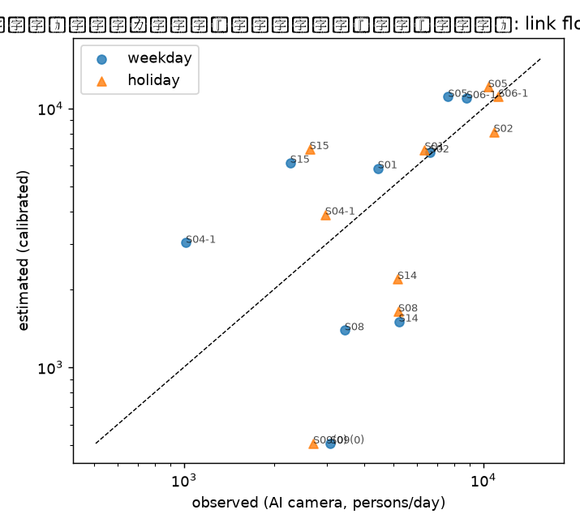

# 評価レポート: 岡山市中心部（岡山駅・奉還町〜西川緑道公園〜表町〜岡山城）（自動生成: `jinryu calibrate`）

- 基準期間: 2019-10（人流オープンデータ）／実測: 岡山市 AIカメラ通行量（2024年〜）の全月平均
- 較正地点数: 9 箇所（街路地点のみ。地下街・入退場・広場地点は除外）× 平日/休日 = 18 観測
- 採用パラメータ: half_distance = 450 m, スケール k = 0.5108

## 指標

| 評価 | n | Spearman | MAPE | 上位20%一致率 |
|---|---|---|---|---|
| in-sample | 18 | 0.631 | 0.655 | 0.75 |
| 空間ブロック CV (leave-one-block-out: ekimae, heiwacho, hokancho, omotecho) | 18 | 0.685 | 0.734 | 0.75 |

H1 の目標 Spearman ≥ 0.6: **達成**

## 距離抵抗の格子探索

| half_distance (m) | k | Spearman (in) | Spearman (CV) | MAPE (in) |
|---|---|---|---|---|
| 300 | 0.7031 | 0.625 | 0.676 | 0.623 |
| 450 | 0.5108 | 0.631 | 0.685 | 0.655 |
| 600 | 0.4406 | 0.625 | 0.676 | 0.675 |
| 900 | 0.3843 | 0.641 | 0.682 | 0.696 |
| 1300 | 0.3555 | 0.66 | 0.682 | 0.708 |

## 散布図

## 地点別

| 地点 | ブロック | 平休 | 実測 | 合成値 | 推定 | 比 |
|---|---|---|---|---|---|---|
| S05 岡山駅前商店街（ビックカメラ商店街入口付近） | ekimae | holiday | 10373 | 23639 | 12074 | 1.16 |
| S05 岡山駅前商店街（ビックカメラ商店街入口付近） | ekimae | weekday | 7627 | 21683 | 11075 | 1.45 |
| S06-1 本町（髙島屋東付近） | ekimae | holiday | 11220 | 21707 | 11087 | 0.99 |
| S06-1 本町（髙島屋東付近） | ekimae | weekday | 8781 | 21418 | 10940 | 1.25 |
| S14 平和町１（ハレまち通り平和橋付近） | heiwacho | holiday | 5168 | 4293 | 2193 | 0.42 |
| S14 平和町１（ハレまち通り平和橋付近） | heiwacho | weekday | 5219 | 2938 | 1501 | 0.29 |
| S15 平和町２（西川緑道公園平和橋付近） | heiwacho | holiday | 2628 | 13624 | 6959 | 2.65 |
| S15 平和町２（西川緑道公園平和橋付近） | heiwacho | weekday | 2264 | 12071 | 6166 | 2.72 |
| S08 奉還町商店街（りぶら付近） | hokancho | holiday | 5201 | 3214 | 1642 | 0.32 |
| S08 奉還町商店街（りぶら付近） | hokancho | weekday | 3443 | 2720 | 1390 | 0.40 |
| S09 西奉還町商店街（奉還町３丁目付近） | hokancho | holiday | 2702 | 0 | 0 | 0.00 |
| S09 西奉還町商店街（奉還町３丁目付近） | hokancho | weekday | 3083 | 0 | 0 | 0.00 |
| S01 表町・上之町商店街（北時計台付近） | omotecho | holiday | 6368 | 13559 | 6926 | 1.09 |
| S01 表町・上之町商店街（北時計台付近） | omotecho | weekday | 4443 | 11483 | 5865 | 1.32 |
| S02 表町・中之町商店街（天満屋北付近） | omotecho | holiday | 10831 | 15878 | 8110 | 0.75 |
| S02 表町・中之町商店街（天満屋北付近） | omotecho | weekday | 6622 | 13235 | 6760 | 1.02 |
| S04-1 表町・千日前商店街（千日前ハレノワ通り付近） | omotecho | holiday | 2963 | 7610 | 3887 | 1.31 |
| S04-1 表町・千日前商店街（千日前ハレノワ通り付近） | omotecho | weekday | 1015 | 5920 | 3024 | 2.98 |

## 外れ値と考察（v0.1）

- 駅前広場（S07-1）は駅出入りの「上り下り」カウントで、街路通行量とは性質が異なるため較正から除外。地下街 4 地点（S10〜S13）も同様。
- 人流データ（2019〜2021年）と実測（2024年〜）で期間が 3〜5 年ずれている。相対的な空間分布は安定という仮定を置いている。
- 表町商店街（アーケード）は OSM 上 pedestrian/footway として繋がっているが、天満屋などの大規模商業の集中点をアーケード側の前面リンクに正しく寄せられているかは要確認。
- 較正地点が 10 箇所前後と少なく、Spearman の信頼区間は広い。隔年の「岡山市商店街等通行量調査」（時間帯別・多地点）を手入力 CSV で追加することが精度評価の最優先課題。

### Spearman 未達時の原因仮説（3つ）

1. **集中点の重み**: 延床面積×用途係数 α だけでは、百貨店・駅ビルのような「来訪者密度」の高い施設を過小評価する。POI 密度や売場面積（経済センサス）で補正する。
2. **経路配分が all-or-nothing**: 並行する街路（アーケード vs 車道歩道）の分担が極端になる。確率的配分（ロジット）や歩行環境ペナルティが必要。
3. **発生点の粒度**: 1km メッシュの深夜人口を住宅に配分した発生量は、駅からの流入（乗降客数）に比べ粗い。商用人流（500m/100m メッシュ）でメッシュ側の解像度を上げる。