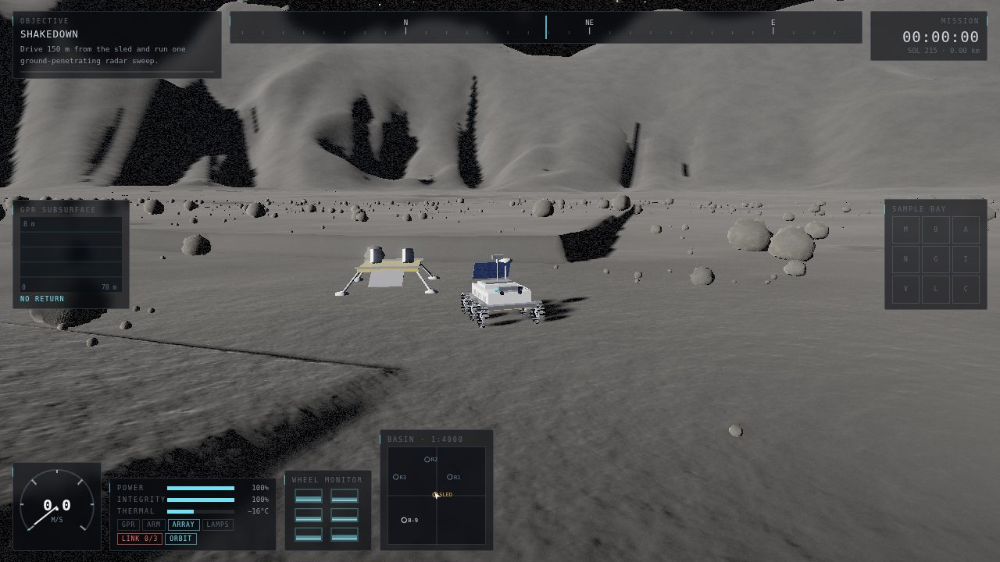
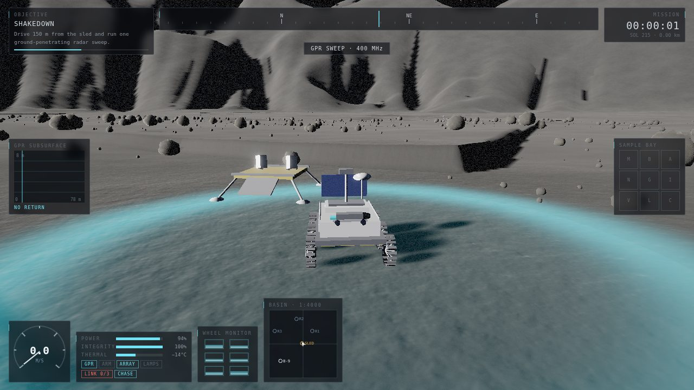
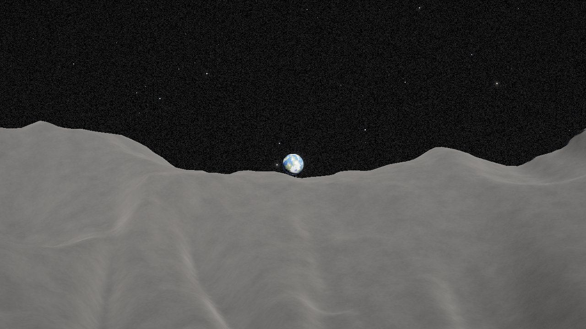
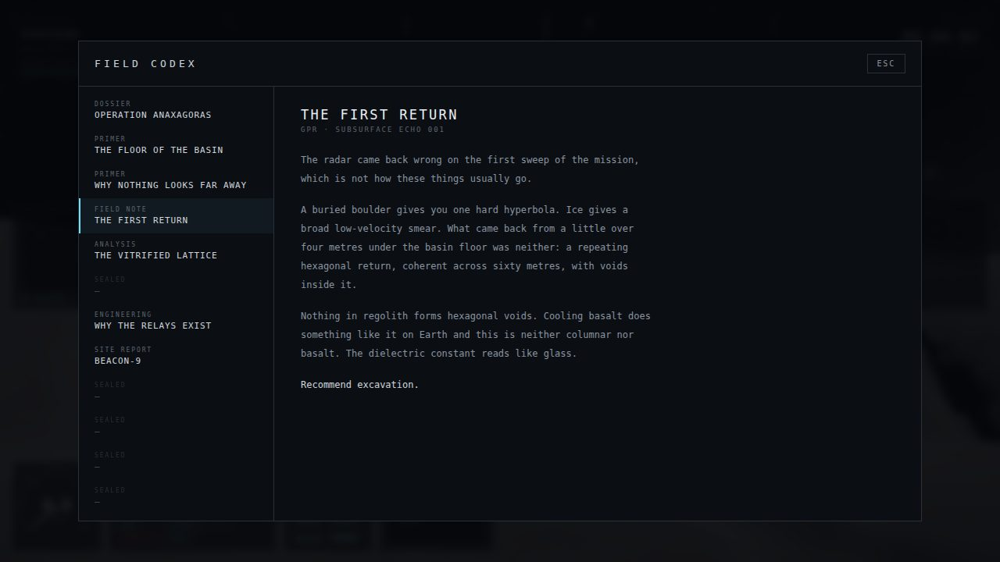
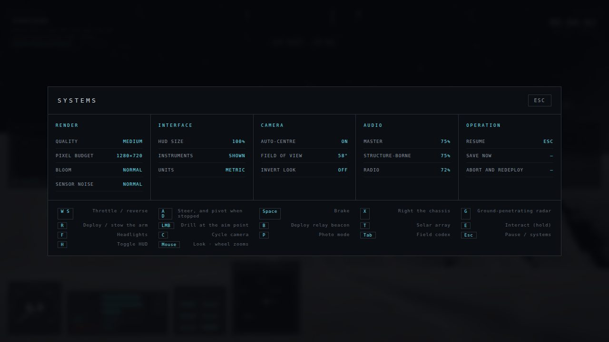
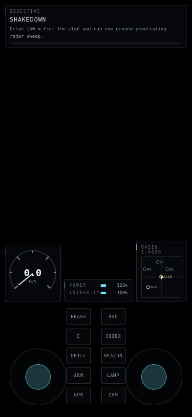

<div align="center">

# REGOLITH

### The Silence at Anaxagoras

**A lunar rover survey game that runs in a browser tab.**
No engine, no build step, no dependencies, no downloaded assets — and no vendored 3D library either.




</div>

> Two hundred and fourteen days ago the far-side outpost **Beacon-9** sent four
> seconds of empty carrier and stopped.
>
> You operate **MU-7 CASSIOPEIA**, a 900 kg six-wheel survey rover put down by
> descent sled on the floor of Anaxagoras at 73° north. Survey the basin,
> restore the relay chain, and find out what is under the floor — and why the
> dossier does not say what the station was *for*.

---

## Look at it

|  |  |
|:--|:--|
|  <br> **Driving.** A radar sweep going out at 400 MHz. The cyan wavefront is a real query against the subsurface field, not a decal — what reaches the scope is what the query returned. |  <br> **Earth never gets high.** At 73° north it sits 13°–16° up, so from the basin floor the rim wall is in the way. That is the entire reason the relay mission exists. |
|  <br> **The codex** fills in as you survey. Twelve entries, most of them sealed until you have been somewhere or drilled something. |  <br> **Systems.** Quality, HUD size, camera and audio, plus the control sheet. `HUD SIZE` scales every instrument panel from a single CSS variable. |

<div align="center">


*On a phone the instrument list is cut to what you steer by, and the bottom of the screen belongs to your thumbs.*
</div>

---

## About this project

This is a reconstruction. It was built from scratch as a reproduction of
[winchxyz/moon-rover](https://github.com/winchxyz/moon-rover) — same premise,
same design constraints, same basin — but none of its code. Where the original
vendors three.js, this one talks to WebGL2 directly, which is why the whole
game is about a fifth of the download.

There are **no downloaded assets**, and the game fetches none at runtime. Every
texture, every rock, every star and every sound is generated by code at load
time. The world is a pure function of one integer: a save file stores a
position and a mission index, and the same 500 metres of crater floor comes
back.

It is not a finished game. It *is* a real one: it has a beginning, five
missions, an ending, and a rover that will dig itself into a hole if you sit
there with the throttle down — though it can still climb out of one.

| | |
|--:|:--|
| **6,105** | lines of JavaScript in `src/` |
| **478** | lines of CSS |
| **0** | dependencies, build steps, and asset files the game loads |
| **5** | missions · **12** codex entries · **9** sample types |
| **~81 KB** | gzipped over the wire, all of it first-party |

---

## Play

```bash
npm start
```

Then open <http://localhost:5173>. Any static file server works — the only
requirement is HTTP rather than `file://`, because it uses ES modules. Node 18+
for the bundled server, which has no dependencies either.

Chrome, Edge, Firefox, Safari 15+. Needs WebGL2. Works on phones and tablets
with twin thumbsticks. Progress autosaves to `localStorage` every 20 seconds.

### One file, no server

```bash
npm run build      # writes regolith.html
```

**[`regolith.html`](regolith.html)** is the whole game in a single document —
every module, the stylesheet and the boot screen folded together, ~260 KB,
no server and no network. Double-click it.

The game does not need a build step and this is not one: it exists because ES
modules cannot be loaded over `file://`, so opening `index.html` directly gets
you a blank page. `build/single-file.mjs` gives each module its own scope inside
a function and stands a nine-line registry in for `import`; nothing is minified
and nothing is rewritten cleverly. Browsers refuse `localStorage` to `file://`
pages, so the single-file build simply does not save — everything else,
including the whole mission chain, works.

It is a static site with no build step, so GitHub Pages needs nothing special
beyond pointing at the directory this README lives in. Every path in the page is
relative, so it works from a subdirectory without configuration.

---

## Controls

| | |
|---|---|
| `W` `S` | Throttle / reverse |
| `A` `D` | Steer — and pivot on the spot when stopped |
| `Space` | Brake |
| `X` | Right the chassis after a rollover |
| `G` | Ground-penetrating radar sweep (78 m) |
| `R` | Deploy / stow the sampling arm |
| `W` `S` `A` `D` | With the arm out: reach and swing it |
| `LMB` | Drill at the aim point |
| `B` | Deploy relay beacon |
| `T` | Deploy / stow the solar array |
| `E` | Interact (hold) |
| `F` | Headlights |
| `C` | Cycle camera · `P` photo mode |
| `Tab` | Field codex |
| `Esc` | Pause / systems |
| `H` | Toggle HUD |

Mouse looks, wheel zooms. Gamepads work. On phones and tablets you get twin
thumbsticks and two button groups, including `HUD` to clear the instruments off
the screen. They stack as columns beside the sticks — except on a landscape
phone, where they drop into a single row between them.

The chase camera drifts back behind the rover only after you have left the
mouse alone for about three seconds. Set **AUTO-CENTRE** to OFF under `Esc` if
you would rather it never moved on its own.

---

# The technical side

Everything below is in this repository, in plain ES modules you can open and
read. The interesting parts are not the rendering tricks — they are the places
where the physics and the pixels are forced to agree.

## What is actually simulated

### One sixth of a gravity, and the consequences

1.62 m/s². The suspension is sized for **lunar** weight — 1458 N total, about
9 cm of static sag at 2700 N/m a corner. Earth spring rates make the rover act
like a steel bar. Peak traction is roughly 1240 N against a 900 kg body, so it
accelerates at about 1.3 m/s² and reaches 4.5 m/s on the flat.

### Wheels, not a capsule

A rigid body with a real inertia tensor and six raycast wheels, each with
spring-damper suspension, slip-based tyre forces inside a friction circle, and
pressure-based sinkage — a saturating linear model, not a true Bekker
pressure-sinkage curve. Contact pressure over the bearing strength of the top
few centimetres of regolith (~12 kPa) gives 1–2 cm of sink at static load and
about 6 % of weight in rolling resistance, which is roughly what Apollo
measured.

The wheel-spin integration is solved **semi-implicitly**, because the hub's
inertia is tiny next to the slip stiffness and an explicit step oscillates and
then explodes:

```js
spinNew = (w + dt*T/I + dt*K*R*vLong/I) / (1 + dt*K*R*R/I)
```

### A rut, not a decal

The wheels cut real geometry into the height field **the physics reads back**:
a trough with the displaced regolith piled into berms along both flanks, so the
track catches raking light and throws its own shadow.

Each texel remembers how far it has already been displaced, in millimetres.
Without that ledger a parked wheel subtracts its own sinkage every frame and
falls through the Moon; with it the rut converges on the depth the contact
pressure justifies — and a spinning wheel, which asks for a deeper one, digs.
Compacted rut floor never slumps; churned rut floor creeps back about halfway
over a couple of seconds.

### Ballistic dust

There is no air, so there is no billowing cloud and no settling haze. Every
grain flies a clean parabola at 1.62 m/s² and lands where the arithmetic says.
That single fact is what makes lunar rooster tails look lunar, and it is why
`dust.js` is a hundred lines instead of a fluid solver.

### The photometric function

The surface uses **Lommel–Seeliger** rather than Lambert, which is why the Moon
reads as a flat disc instead of a shaded ball, plus a coherent-backscatter
opposition surge that washes the ground out when you drive down-sun. Distant
terrain barely dims — no atmosphere means no aerial perspective, which is
exactly why lunar photographs have no sense of scale.

### Light

A grazing sun 21° above the horizon, because at 73° north that is what it does.
Crater shadows come from a baked sun-occlusion mask, and it is a **single sweep
across the field** rather than a ray march per texel:

```
H(p) = max( h(p+Δ), H(p+Δ) ) − s·tan(elevation)
```

A point is in shadow when `H(p) > h(p)`. The blocker's distance is carried
along the same recurrence, so the penumbra can be sized from the sun's real
0.53° angular diameter — which is why the shadow edges look like they could cut
you, and why the sharpness changes with how far away the ridge casting it is.

The rover's own shadow does not use a shadow map at all. The terrain shader
tests the sun ray against twelve spheres — chassis, mast and six wheels — which
is the whole vehicle for the cost of one loop.

### Power

The array charges only in sunlight. Running flat does not strand you: the drive
is not wired to the pack, so a dead battery costs you the radar and the drill,
not your ride home.

---

## Rendering

### Terrain

A **nine-level geometry clipmap**: 0.25 m cells under the wheels out to 64 m
cells on an outer ring 8 km across, about 229 k triangles, with zero per-frame
CPU geometry work — one vertex buffer, two index buffers, nine draw calls with
a different origin and cell size each.

Heights are baked once on the CPU into R32F textures with a box-filtered mip
chain, and each ring samples the mip matching its own cell size. Without that
chain the coarse rings interpolate straight across crater bowls and leave a row
of tents on the skyline. R32F rather than half-float because 16 bits quantises
height to 12 cm at 160 m and you can see it.

Two nested fields: a fine one at 0.25 m per texel spanning ±256 m, which is the
ground you drive on and the only one excavation touches, and a coarse one at
8 m per texel spanning ±4 km, which carries the rim wall and the massifs out to
the horizon. They cross-fade over 36 metres.

### Physics and pixels agree exactly

The GPU never re-derives a height. It samples the same baked field the wheels
do — and it filters it **in software**, four `texelFetch` calls and two `mix`
calls, rather than relying on `OES_texture_float_linear`. That is not a
fallback path: it is the only path, because it is the only way to be certain the
shader and the CPU agree to the last bit. `npm test` walks 400 points and checks
the two filters against each other; the error is exactly zero.

This is the constraint the whole terrain system is built around. If the two ever
disagree, the rover floats or sinks, and no amount of tuning fixes it.

### Excavation

The fine field is CPU-authoritative and uploaded as small dirty rects. Only the
touched rectangles are re-uploaded, tracked as a **region list, not a growing
union** — and rects only merge while the result stays under 4096 cells, because
a union grows along the whole driven path and never shrinks.

### Boulders

One instanced draw per base shape, with a triplanar procedural surface:
mottled plagioclase, chipping normals that fade with distance so pebbles do not
alias, and regolith dust settling on every up-face.

### Post

Linear HDR through the chain, a four-level bloom, ACES, and a final pass that
treats the image as what it is in fiction — a camera bolted to a rover, with
sensor noise that rises in shadow and a veiling glare toward the sun. The noise
needs a ceiling as much as it needs a floor: `1/(0.1 + luminance)` with
luminance near zero is a wall of static, and out here half the frame is near
zero.

### Performance

The framebuffer is capped by **total pixel count**, not by device pixel ratio.
This matters more than it sounds: a Retina MacBook reports `devicePixelRatio` 2,
so the obvious `setPixelRatio(dpr)` on a 1710-point-wide window renders
3420×2136 — **7.3 megapixels** — through a shader that filters height fields by
hand. Capping pixels instead brings that to 2.4 Mpx while still rendering above
native CSS resolution.

```js
let px = Math.min(devicePixelRatio, quality.maxDpr);
const over = (w * h * px * px) / quality.pixels;   // pixels, not ratio
if (over > 1) px /= Math.sqrt(over);
```

On top of that a governor watches a rolling frame time and trades resolution for
smoothness between 100 % and 62 %, giving it back when there is headroom.

---

## The HUD on a small screen

Every instrument dimension is a multiple of **one CSS variable**, so the whole
panel set scales from a single knob and keeps its proportions instead of forty
pixel values drifting apart. Type carries a floor the scale cannot push through:
shrinking the HUD takes space off canvases, bars and padding, never off
legibility.

```css
.hud { --u: 1px; --s: calc(var(--u) * var(--hud-k)); }
.gauges { width: calc(214 * var(--s)); }
.gauge label { font-size: max(8px, calc(8.5 * var(--s))); }
```

Scaling alone stops working somewhere around tablet size. A 393 px screen cannot
carry mission control at any size you can still read — shrink far enough and you
have nine panels of 6 px type covering half the view. So **phones drop
instruments instead**, and the survivors get *bigger* than the tablet's:
objective, speed, power, integrity, map. The compass strip, sample bay, thermal,
status chips, wheel monitor, radar scope and mission clock are reference
readouts nobody reads mid-corner, and they are all still in the pause panel.

The other rule is that **thumbs own the bottom of the screen**. On any device
that mounts the sticks, the HUD moves above them — keyed on a class set by the
code that actually creates the controls, not a `pointer: coarse` media query,
since those two can disagree and the question that matters is whether there are
thumbsticks on screen right now.

A landscape phone is short rather than narrow, and it is the case that breaks
every assumption. The HUD runs along the top edge there instead of stacking, and
the **buttons stop being columns**: five stacked buttons plus a stick is 300 px
of a 393 px screen, so the columns climbed the edges straight into the mission
panel and the map. They become a single row along the bottom, in the dead strip
between the two sticks, which hands the entire top of the screen back to the HUD.

| viewport | HUD coverage | smallest type |
|---|--:|--:|
| 393 × 852 · phone | 19 % | 8.5 px |
| 852 × 393 · phone, landscape | 15 % | 8.0 px |
| 820 × 1180 · tablet | 16 % | 8.0 px |

---

## Audio

Nothing carries sound out there. What you hear is what the chassis carries, so
all of it is structure-borne and dull; the only bright things in the mix are
electrical — the radio, the GPR chirp, the alarms. Everything is synthesised at
runtime and there are **no audio files**.

The motor is one band-limited pulse train — a commutating hub, built as a
`PeriodicWave` with a fixed harmonic count so it cannot alias however fast the
wheel turns — fed through a bank of **fixed** resonators standing in for the
chassis, at 172 / 418 / 905 Hz. That split is what makes it read as a machine
rather than a siren: the excitation pitch rides the wheel speed while the body
formants stay exactly where they are, and load opens the upper ones.

Regolith is granular, because gravel is not a filtered hiss — it is thousands of
separate impacts. Individual grains are scheduled on a lookahead clock at a rate
set by wheel speed and slip, each with its own pitch, filter and stereo
position.

---

## Layout

```
index.html          shell, boot screen, HUD markup
server.js           zero-dependency static server
regolith.html       the whole game as one file, built by build/
build/
  single-file.mjs   folds src/ and the stylesheet into regolith.html
test/
  field-agreement.mjs  the invariants, headless, no framework
src/
  main.js           bootstrap, loading, menus, frame loop        341
  core/
    engine.js       framebuffer sizing, bloom, output pass       288
    gl.js           programs, VAOs, textures, pixel budget       224
    math.js         vec3 / mat4 / quat                           291
    mesh.js         procedural geometry builder                  186
    solid.js        the shader every non-terrain surface uses    270
    audio.js        procedural WebAudio                          289
    input.js        keyboard / mouse / gamepad / touch           160
    rng.js          deterministic noise shared by CPU and bake   135
    save.js         localStorage                                  34
  world/
    terrain.js      bake, clipmap, excavation, sun mask         1011
    sky.js          stars, Milky Way, the sun, Earth             378
    props.js        boulders, the sled, Beacon-9, the relays     266
    dust.js         ballistic regolith                           171
  game/
    rover.js        the machine and its physics                  654
    gameplay.js     subsurface, radar, drill, power, missions    448
    lore.js         codex, samples, mission definitions          188
    camera.js       chase / orbit / mast / free                  154
  ui/
    hud.js          instruments, minimap, codex, systems         617
    styles.css      scale system, three-row HUD grid, responsive 478
docs/               the screenshots in this README
```

## Development

`window.REGOLITH` exposes the running app, plus `REGOLITH.tick(dt)` to advance a
single frame by hand — which is how every screenshot in this README was taken.
`REGOLITH.terrain.debug = 1..6` swaps the terrain shader's output for the term
you are chasing: shadow, normal, `mu0`, Lommel–Seeliger, clipmap level, albedo.
`REGOLITH.cam.lookAlong(dir, from)` points the free camera at something, which
is the only sane way to find a body 380 000 km away.

## Licence

**MIT** — do what you like with it.

There are no third-party assets and no vendored libraries. Every texture, every
mesh and every sound is generated at runtime by code in this repository.

<div align="center">
<br>

*"Shadows here do not shorten at midday. They only turn."*

</div>
