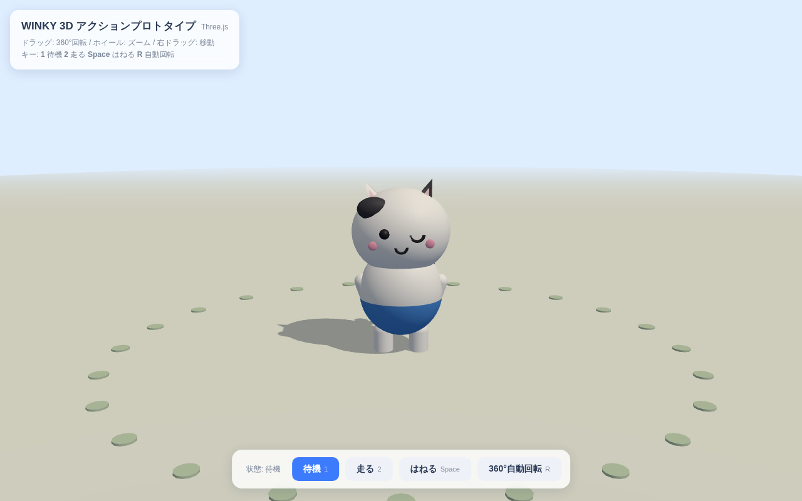
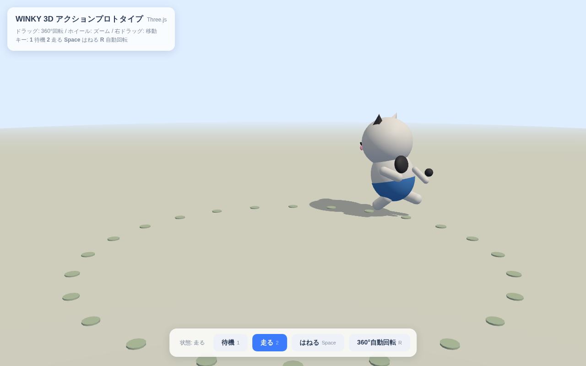
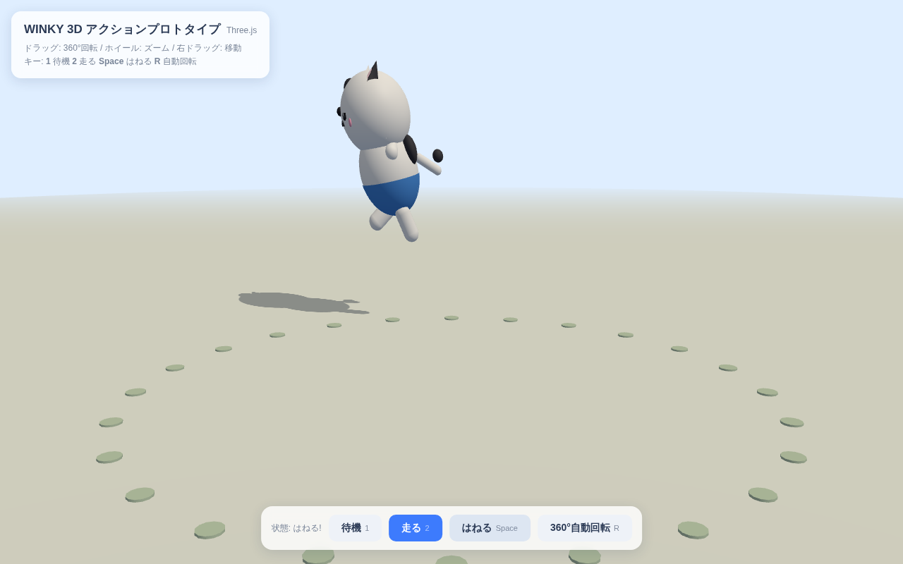
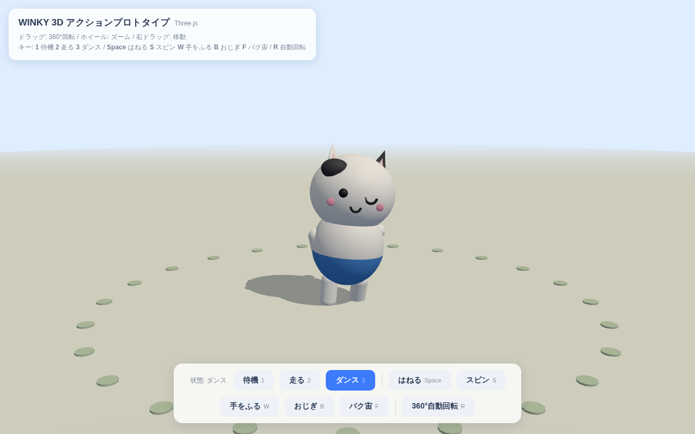
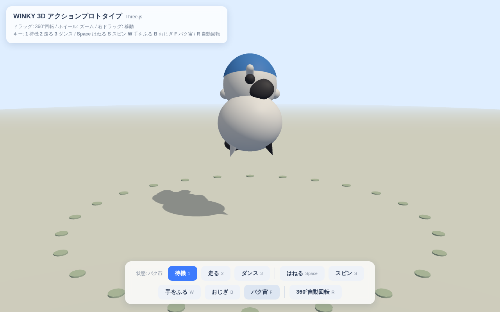
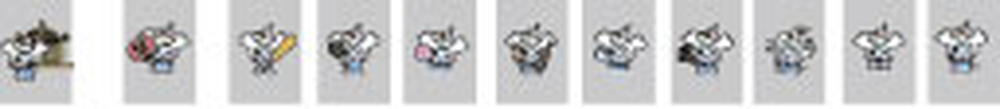

# WINKY 3D アクションプロトタイプ

WINKY キャラクターを 360° 回転で眺められる 3D にし、「走る」「はねる」などのアクションを
確認できるブラウザプロトタイプです。

| 待機 | 走る | はねる |
|---|---|---|
|  |  |  |

| ダンス | バク宙 |
|---|---|
|  |  |

## 実行方法

ビルド不要。ローカルサーバーを立ててブラウザで開くだけです。

```bash
cd prototype
python3 -m http.server 8000
# → http://localhost:8000 を開く
```

(`npx serve` でも可。GitHub Pages にそのままデプロイも可能)

## 操作方法

| 操作 | 内容 |
|---|---|
| ドラッグ | 360° 回転(オービット) |
| ホイール | ズーム |
| 「待機」/ `1` | 待機モーション(呼吸・耳の揺れ) |
| 「走る」/ `2` | 円形コースを走る(ループ) |
| 「ダンス」/ `3` | リズムに乗って踊る(ループ) |
| 「はねる」/ `Space` | ジャンプ(スカッシュ&ストレッチ) |
| 「スピン」/ `S` | その場で 1 回転ターン |
| 「手をふる」/ `W` | 右手を上げて挨拶 |
| 「おじぎ」/ `B` | ていねいなおじぎ |
| 「バク宙」/ `F` | 後方宙返り |
| 「360°自動回転」/ `R` | カメラの自動回転 ON/OFF |

待機・走る・ダンスは「ループ状態」でクロスフェード遷移、はねる・スピン・手をふる・おじぎ・
バク宙は「ワンショットアクション」としてどの状態の上にも重ねて再生できます(走りながらジャンプ等)。

## ツール調査の結果

プロトタイピングの要件(①360°で見られる 3D 化、②走る・はねるアクション、③すばやく共有・反復
できること)に対して、以下を比較検討しました。

| ツール | 3D化 | アクション | 共有のしやすさ | 学習コスト | 評価 |
|---|---|---|---|---|---|
| **Three.js(WebGL)** ← 採用 | プリミティブ / SVG押し出し / glTF読込 | コードで自由に制御 | URLを開くだけ。ビルド不要 | 低〜中 | ◎ |
| Blender + glTF | 本格的なモデリング・リギング | アニメーションを焼き込み可能 | 書き出したglTFはThree.jsやmodel-viewerで表示 | 高 | ○(本番品質の次ステップ) |
| Spline / Vectary | GUIで手軽に3D化 | プリセット中心で自由度低め | 共有リンクは簡単だが外部サービス依存 | 低 | △ |
| Unity / Unreal (WebGL) | 高機能 | ステート制御も強力 | ビルドが重くプロトタイプには過剰 | 高 | △ |
| AI image-to-3D(Tripo / Meshy / Luma Genie 等) | 1枚絵から自動生成 | 別途リギングが必要 | 生成結果の調整が難しい | 低 | ○(たたき台生成に有用) |
| `<model-viewer>` | glTF表示専用 | 埋め込みアニメ再生のみ | HTMLタグ1つで360°表示 | 低 | ○(閲覧専用なら最適) |

**Three.js を採用した理由**

- インストール不要でブラウザだけで動き、リポジトリごと共有すれば誰でもすぐ確認できる
- OrbitControls で 360° ビューが標準機能として手に入る
- 「走る」「はねる」のような手続きアニメーション(状態マシン+スカッシュ&ストレッチ)を
  コードで細かく調整でき、プロトタイピングの反復が速い
- 本番化するときも Blender → glTF → `GLTFLoader` へ差し替えるだけで同じ土台を使い回せる

three.js は `vendor/` にリポジトリ同梱(v0.160.0)しているため、オフライン・CDN不通でも動きます。

## 元データ(.ai)について — 重要

アップロードされた `WINKY.ai` は **「PDF互換ファイルを作成」オフで保存されている**ため、
Illustrator 以外のツールではベクターデータを取り出せませんでした(ファイル内のプレビューにも
その旨の注意書きが入っています)。抽出できたのはアートボード一覧のサムネイルのみです:



現在の 3D モデルは、このサムネイルから読み取れる特徴(白いネコ風キャラ・ウインク顔・
黒いブチ模様・青いズボン)をプリミティブで近似した**プレースホルダー**です。

### 本物のデザインを反映する手順

1. Illustrator でファイルを開き、**別名で保存 → 「PDF互換ファイルを作成」にチェック**を入れて
   保存し直す(またはキャラクターを **SVG 書き出し**する)
2. 反映ルートは 2 通り:
   - **お手軽(2.5D)**: SVG を Three.js の `SVGLoader` + `ExtrudeGeometry` で押し出して、
     現在のリグ(`root > body > head/arms/legs`)のパーツと置き換える。フラットなマスコット
     キャラと相性が良い
   - **本格(フル3D)**: Blender で SVG を下絵にモデリング&リギング → glTF 書き出し →
     `GLTFLoader` で読み込み、`AnimationMixer` で走り・ジャンプのクリップを再生する

## ファイル構成

```
prototype/
├── index.html        # エントリ(UI・importmap)
├── main.js           # シーン・キャラクター・アニメーション状態マシン
├── vendor/           # three.js v0.160.0(同梱)
└── docs/             # スクリーンショット・参照画像
```
